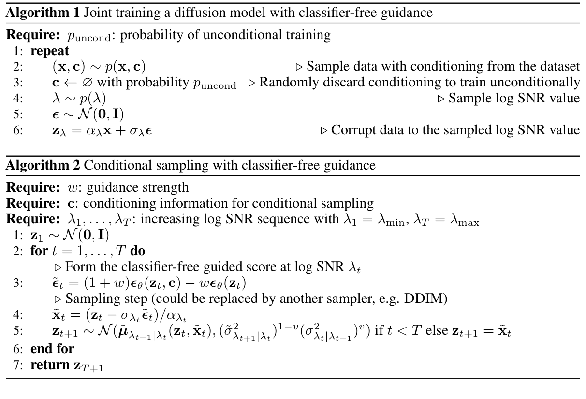
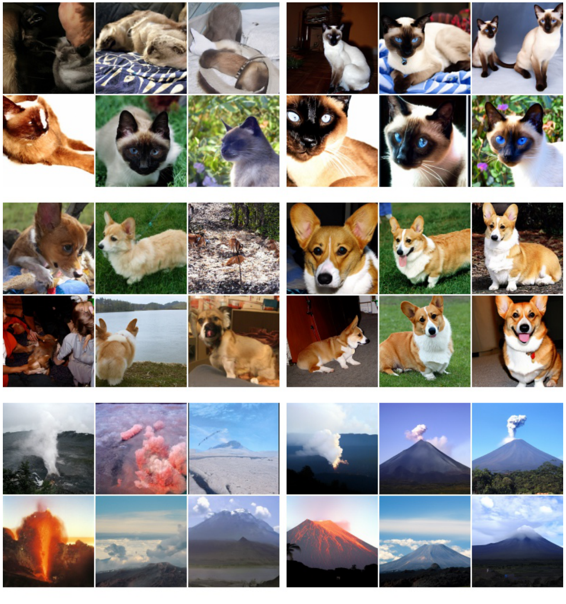

# Classifier-Free Diffusion Guidance

- **Authors**: Jonathan Ho, Tim Salimans
- **Venue/Date**: arXiv 2022; short version at DGMs and Applications @ NeurIPS 2021
- **URL**: [https://arxiv.org/abs/2207.12598](https://arxiv.org/abs/2207.12598)
- **GitHub**: Not available

---

### 1. Background
Conditional diffusion models can generate sharper and more recognizable samples when guidance pushes sampling toward a target class or condition. The previous strong method, classifier guidance, did this by adding gradients from a separately trained classifier. That extra classifier is inconvenient: it must be trained on noisy diffusion states, it cannot simply be replaced by a normal pretrained image classifier, and it complicates the training pipeline. The paper asks whether the same fidelity-diversity control can be obtained using only the generative diffusion model.

### 2. Intuition
Think of the condition as a steering signal. A normal conditional diffusion model already knows how to move toward images matching a class label, but it may steer gently. Classifier-free guidance trains the model to know two directions: "generate an image like this condition" and "generate an image in general." At sampling time, it subtracts part of the general direction and amplifies the conditional direction. The result is a simple knob: higher guidance makes samples more condition-specific and sharper, but less diverse.

### 3. Breakthrough
The breakthrough is to avoid the classifier entirely by training conditional and unconditional behavior inside the same diffusion network. During training, the condition $c$ is randomly dropped with probability $p\_{\mathrm{uncond}}$, so the same model learns both $\epsilon\_\theta(z\_\lambda,c)$ and $\epsilon\_\theta(z\_\lambda)$. During sampling, these two predictions are linearly combined. This turns guidance from an extra-model pipeline into a one-line sampling rule.

### 4. Technical Mechanism

#### 4.1 Pipeline

- (1) The pipeline first trains one diffusion model with random condition dropout, then samples by mixing conditional and unconditional noise predictions at every denoising step. (2) The key controls are $p\_{\mathrm{uncond}}$, which decides how often the condition is removed during training, and $w$, which sets guidance strength during sampling.

#### 4.2 Architecture / Core Design

- (1) The toy density figure shows what guidance does geometrically: as guidance increases, probability mass becomes more concentrated inside each conditional mode and farther from the other classes. (2) The core design choice is not to train a classifier, but to estimate both conditional and unconditional scores with the generative model itself.

#### 4.3 Core Equation
- The classifier-free guided prediction is a linear combination of conditional and unconditional diffusion predictions:

$$
\tilde{\epsilon}_\theta(z_\lambda,c) = (1+w)\epsilon_\theta(z_\lambda,c) - w\epsilon_\theta(z_\lambda)
$$

- Variables:
  - $z\_\lambda$: the noisy diffusion state at log-SNR level $\lambda$.
  - $c$: conditioning information, such as an ImageNet class label.
  - $\epsilon\_\theta(z\_\lambda,c)$: the conditional noise prediction.
  - $\epsilon\_\theta(z\_\lambda)$: the unconditional noise prediction, implemented by feeding the null condition.
  - $w$: guidance strength; larger values push samples harder toward the condition.
  - $\tilde{\epsilon}\_\theta(z\_\lambda,c)$: the guided prediction used by the sampler instead of the raw conditional prediction.

#### 4.4 Comparison: Others vs This Paper
The paper's claim is that guidance does not require an external classifier. Classifier guidance can improve sample fidelity, but it needs a noisy-state classifier and mixes the diffusion score with classifier gradients. Classifier-free guidance replaces that extra model with joint conditional/unconditional training and a sampling-time linear combination (Algorithms 1 and 2). Experiments on ImageNet 64 x 64 and 128 x 128 show the same kind of FID/IS tradeoff as classifier guidance: small guidance improves FID, while strong guidance raises Inception Score and reduces diversity (Tables 1 and 2 / Figs. 4 and 5). The trade-off is speed, because naive classifier-free sampling evaluates the diffusion model twice per step.

#### 4.5 Qualitative Results

The qualitative image compares non-guided samples on the left with classifier-free guided samples on the right for 128 x 128 ImageNet. The guided samples look more class-specific and visually decisive: cats look more like cats, dogs become cleaner, and volcano images become more iconic. The figure also shows the cost of the knob. Strong guidance can make colors saturated and reduce variation, matching the paper's quantitative fidelity-diversity tradeoff.

### 5. Impact
Classifier-free guidance became a standard control mechanism for diffusion generation. It is especially important because it is simple, model-agnostic, and does not require a separate classifier. Later text-to-image systems use the same idea to make prompts matter more strongly at sampling time. In practice, the guidance scale became one of the most familiar user-facing diffusion controls because it directly trades diversity for prompt adherence and perceived sharpness.

### 6. Further Reading
[1] [Denoising Diffusion Probabilistic Models (2020)](https://arxiv.org/abs/2006.11239) 
Defines the DDPM framework and noise-prediction training objective that classifier-free guidance builds on. 
[2] [Diffusion Models Beat GANs on Image Synthesis (2021)](https://arxiv.org/abs/2105.05233) 
Introduces classifier guidance as a strong baseline for trading diversity for fidelity in diffusion sampling. 
[3] [GLIDE: Towards Photorealistic Image Generation and Editing with Text-Guided Diffusion Models (2021)](https://arxiv.org/abs/2112.10741) 
Applies guidance ideas to text-conditioned diffusion and image editing. 
[4] [High-Resolution Image Synthesis with Latent Diffusion Models (2022)](https://arxiv.org/abs/2112.10752) 
Shows how diffusion can be moved into latent space, where classifier-free guidance later became widely used. 
[5] [Photorealistic Text-to-Image Diffusion Models with Deep Language Understanding (2022)](https://arxiv.org/abs/2205.11487) 
Demonstrates large-scale text-to-image diffusion where guidance strength is central to sample quality and text alignment. 
