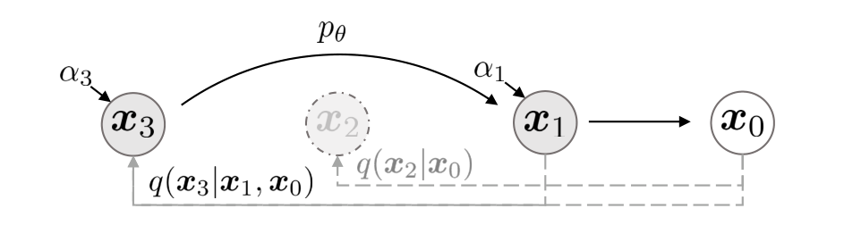
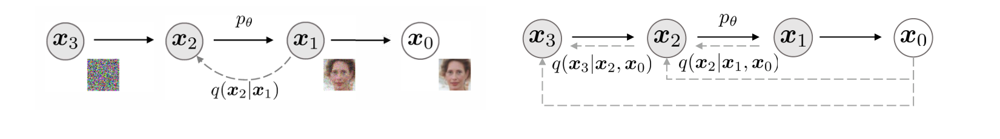
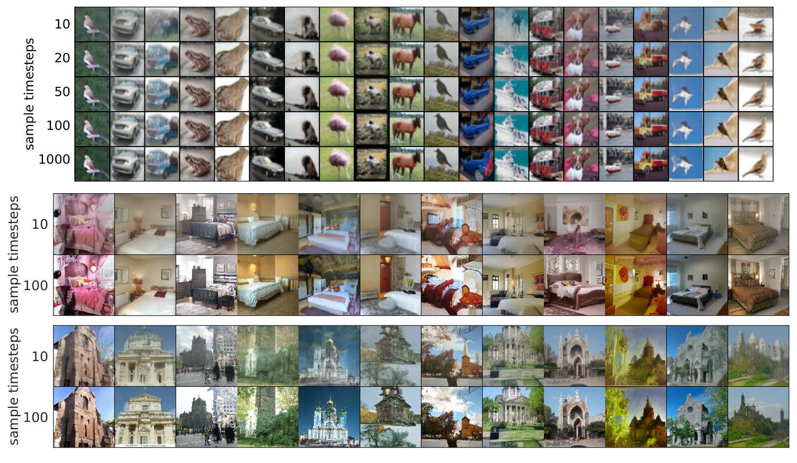

# Denoising Diffusion Implicit Models

- **저자**: Jiaming Song, Chenlin Meng, Stefano Ermon
- **학회/날짜**: ICLR 2021
- **URL**: [https://arxiv.org/abs/2010.02502](https://arxiv.org/abs/2010.02502)
- **GitHub**: [https://github.com/ermongroup/ddim](https://github.com/ermongroup/ddim)

---

### 1. 배경
DDPM은 diffusion model이 adversarial training 없이도 고품질 이미지를 만들 수 있음을 보였습니다. 하지만 큰 엔지니어링 병목도 드러냈습니다. 샘플 하나를 만들려면 수백 개에서 수천 개의 잡음 제거 단계를 순서대로 실행해야 했습니다. GAN은 generator를 한 번만 통과하면 되므로 훨씬 빨랐습니다. 핵심 질문은 이미 학습된 denoising network를 그대로 쓰면서 더 짧은 생성 경로를 사용할 수 있느냐였습니다. DDIM은 DDPM의 느린 Markov chain이 유일한 샘플링 방법이 아님을 보였기 때문에 필요했습니다.

### 2. 직관
DDPM을 높은 건물의 계단을 한 칸씩 모두 내려가는 일이라고 생각해 보세요. 안전하지만 느립니다. DDIM은 몇 층을 건너뛰어도 같은 로비에 도착할 수 있는지 묻습니다. 중요한 점은 걷는 사람을 다시 훈련시키는 것이 아니라, 같은 건물 안에서 다른 경로를 고르는 것입니다. diffusion 관점에서는 모델이 여전히 noisy image에서 잡음을 제거하도록 학습되지만, 샘플링은 선택된 timestep만 따라가는 더 짧고 때로는 결정적인 trajectory를 사용합니다.

### 3. 돌파구
핵심 돌파구는 DDPM의 forward diffusion을 같은 marginal distribution $q(x\_t \mid x\_0)$를 보존하는 non-Markovian inference process 계열로 일반화한 것입니다. 학습 목적식은 전체 forward chain의 정확한 형태보다 각 timestep의 marginal에 의존하므로, 같은 DDPM-trained network가 여러 reverse process를 지원할 수 있습니다. 그중 reverse noise term을 제거한 deterministic case가 DDIM입니다. 이 implicit model은 훨씬 빠르게 샘플링할 수 있고, 일관성과 interpolation에 유용한 의미 있는 latent $x\_T$를 제공합니다.

### 4. 기술적 메커니즘

#### 4.1 파이프라인

- (1) 이 그림은 모든 중간 상태를 방문하지 않고 $\tau=[1,3]$처럼 timestep의 부분열만 샘플링하는 accelerated generation을 보여줍니다. (2) 핵심 변수는 trajectory ($\tau$)이며, 샘플링 시 신경망을 몇 번 평가할지를 결정합니다.

#### 4.2 아키텍처 / 핵심 설계

- (1) 이 그림은 DDPM의 Markovian inference model과 DDIM의 non-Markovian inference model을 대비합니다. DDIM은 timestep별 marginal을 유지하면서 noisy state를 $x\_0$와 직접 연결할 수 있습니다. (2) 핵심 설계 선택은 학습 절차를 바꾸지 않고, 같은 denoising model $\epsilon\_\theta$를 재사용한 채 sampling process만 바꾸는 것입니다.

#### 4.3 핵심 공식
- DDIM sampling update는 논문의 핵심 조절 장치를 드러냅니다.

$$
x_{t-1} = \sqrt{\alpha_{t-1}}\left(\frac{x_t-\sqrt{1-\alpha_t}\epsilon_\theta^{(t)}(x_t)}{\sqrt{\alpha_t}}\right) + \sqrt{1-\alpha_{t-1}-\sigma_t^2}\epsilon_\theta^{(t)}(x_t) + \sigma_t\epsilon_t
$$

- 변수:
  - $x\_t$: timestep ($t$)에서의 현재 noisy sample입니다 (섹션 2 / 공식 3).
  - $x\_{t-1}$: reverse update를 한 번 적용한 다음 sample입니다 (섹션 4.1 / 공식 12).
  - $\epsilon\_\theta^{(t)}(x\_t)$: timestep ($t$)에서 학습된 denoising network가 예측한 noise입니다 (섹션 4.1 / 공식 12).
  - $\alpha\_t$: 각 marginal $q(x\_t \mid x\_0)$를 정의하는 signal-retention schedule입니다 (섹션 2 / 공식 3).
  - $\sigma\_t$: stochasticity control입니다. $\sigma\_t=0$이면 deterministic DDIM process가 됩니다 (섹션 4.1).
  - $\epsilon\_t$: reverse process가 stochastic할 때만 사용하는 새 Gaussian noise입니다 (섹션 4.1 / 공식 12).

#### 4.4 비교: 다른 기술 vs 이 논문
이 논문의 주장은 denoising model을 다시 학습하지 않고도 diffusion sampling을 가속할 수 있다는 것입니다. DDPM은 생성을 긴 reverse Markov chain으로 다루므로, 많은 step을 건너뛰면 보통 품질이 크게 떨어집니다. DDIM은 inference family를 바꿉니다. 같은 학습 목적식을 유지하면서도 훨씬 짧은 non-Markovian reverse trajectory를 정의합니다 (섹션 3 / 섹션 4.2). 실험적으로 trajectory가 10, 20, 50, 100 step일 때 DDIM은 stochastic DDPM-style sampling보다 훨씬 좋은 FID를 보이고, 원래 DDPM 대비 10배에서 50배의 wall-clock speedup을 보고합니다 (Table 1 / Fig 4). 단점은 DDIM도 여전히 반복 sampler라는 점입니다. 병목을 크게 줄이지만, 순차 잡음 제거 자체를 완전히 없애지는 않습니다.

#### 4.5 정성적 결과

정성적 그림은 DDIM의 consistency property를 보여줍니다. 각 열은 같은 초기 latent $x\_T$에서 시작하고, 각 행은 서로 다른 sample timestep 수를 사용합니다. step 수가 달라져도 생성된 샘플의 큰 정체성은 비슷하게 유지됩니다. 같은 종류의 물체, 방 배치, 교회 구조가 계속 알아볼 수 있게 남아 있습니다.

이는 $x\_T$가 버려지는 random noise가 아니라 의미 있는 latent code처럼 작동한다는 뜻입니다. step 수를 늘리면 세부 묘사와 선명도는 좋아지지만, 전역 내용이 완전히 바뀌지는 않습니다. 그래서 DDIM은 stochastic한 DDPM sampling path보다 의미 보간과 reconstruction을 더 자연스럽게 지원할 수 있습니다.

### 5. 영향
DDIM은 diffusion 연구의 질문을 "좋은 이미지를 만들 수 있는가?"에서 "정말 몇 step이 필요한가?"로 옮겼습니다. DDIM은 표준 fast sampler가 되었고, diffusion chain, implicit generative model, probability-flow ODE 관점을 잇는 개념적 다리가 되었습니다. 이후 PNDM과 DPM-Solver 같은 sampler는 이 가속 관점을 직접 이어받아 diffusion sampling을 numerical trajectory 문제로 다루었습니다. 실무적으로도 DDIM은 기존 DDPM-style checkpoint를 재사용하면서 속도-품질 knob를 단순하게 제공하기 때문에 diffusion library에서 널리 쓰이게 되었습니다.

### 6. 후속 연구
[1] [Denoising Diffusion Probabilistic Models (2020)](https://arxiv.org/abs/2006.11239) 
DDIM이 재사용하는 DDPM 학습 목적식과 reverse denoising chain을 정립했습니다. 
[2] [Score-Based Generative Modeling through Stochastic Differential Equations (2021)](https://arxiv.org/abs/2011.13456) 
diffusion model과 score-based model을 연속시간 reverse SDE 및 ODE 관점으로 통합했습니다. 
[3] [Improved Denoising Diffusion Probabilistic Models (2021)](https://arxiv.org/abs/2102.09672) 
reverse-process variance를 학습해 DDPM의 likelihood와 샘플링 효율을 개선했습니다. 
[4] [Pseudo Numerical Methods for Diffusion Models on Manifolds (2022)](https://arxiv.org/abs/2202.09778) 
DDIM을 numerical method로 해석하고 더 높은 품질의 pseudo linear multistep sampler를 제안했습니다. 
[5] [DPM-Solver: A Fast ODE Solver for Diffusion Probabilistic Model Sampling in Around 10 Steps (2022)](https://arxiv.org/abs/2206.00927) 
약 10~20번의 function evaluation만으로 diffusion model을 샘플링하는 전용 high-order ODE solver를 설계했습니다. 
[6] [Consistency Models (2023)](https://arxiv.org/abs/2303.01469) 
one-step 또는 few-step generation을 지원하는 mapping을 학습해 diffusion 가속 문제를 더 밀어붙였습니다. 
