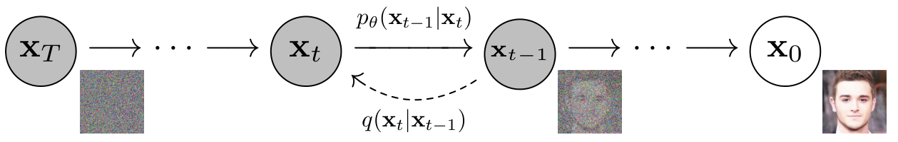
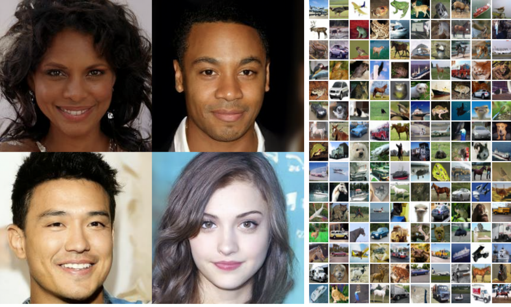

# Denoising Diffusion Probabilistic Models

- **저자**: Jonathan Ho, Ajay Jain, Pieter Abbeel
- **학회/날짜**: NeurIPS 2020
- **URL**: [https://arxiv.org/abs/2006.11239](https://arxiv.org/abs/2006.11239)
- **GitHub**: [https://github.com/hojonathanho/diffusion](https://github.com/hojonathanho/diffusion)

---

### 1. 배경
DDPM 이전의 고품질 이미지 생성은 GAN과 자기회귀 모델이 주도했습니다. GAN은 선명한 이미지를 만들 수 있었지만 학습이 불안정했고 직접적인 likelihood를 다루기 어려웠습니다. 자기회귀 모델은 likelihood를 제공했지만 픽셀을 순서대로 생성해야 해서 느렸습니다. 더 오래된 diffusion probabilistic model은 물리학에서 온 깔끔한 아이디어를 갖고 있었지만, GAN 수준의 이미지 품질을 보여주지는 못했습니다. 이 논문은 단순한 가우시안 노이즈 추가와 제거 과정만으로도 실제 고품질 이미지 생성기가 될 수 있음을 보였기 때문에 필요했습니다.

### 2. 직관
깨끗한 사진에 아주 조금씩 노이즈를 더한다고 생각해 보세요. 이 일을 충분히 반복하면 사진은 완전한 잡음처럼 보입니다. 이 방향은 쉽습니다. 우리가 어떤 노이즈를 넣을지 알고 있기 때문입니다. 어려운 일은 반대 방향입니다. 순수한 잡음에서 시작해 매 단계마다 알맞은 만큼 노이즈를 제거해서 이미지가 다시 나타나게 해야 합니다. DDPM은 이미지 생성을 이 반복적인 청소 문제로 바꿉니다. 한 번에 전체 이미지를 만들라고 시키는 대신, 네트워크에 계속 더 작은 질문을 던집니다. "여기에 섞인 노이즈가 무엇인가?"

### 3. 돌파구
핵심 통찰은 역방향 diffusion 단계를 학습할 때 깨끗한 이미지나 전체 역방향 평균을 직접 맞추는 대신, 주입된 가우시안 노이즈 ($\epsilon$)를 예측하게 만들 수 있다는 점입니다. 이렇게 하면 변분 추론 목적식이 여러 노이즈 수준에서의 단순한 잡음 제거 손실처럼 바뀝니다. 결과적으로 구현 방식도 단순해집니다. timestep을 하나 고르고, 이미지를 그 timestep만큼 오염시키고, U-Net이 노이즈를 예측하게 학습한 뒤, 샘플링 때는 가우시안 노이즈에서 출발해 학습된 역방향 체인을 실행합니다.

### 4. 기술적 메커니즘

#### 4.1 파이프라인

- (1) 이 그림은 서로 반대 방향의 두 Markov chain을 보여줍니다. 고정된 forward process $q(x\_t \mid x\_{t-1})$는 데이터를 점점 노이즈로 만들고, 학습된 reverse process $p\_\theta(x\_{t-1} \mid x\_t)$는 노이즈를 제거하며 데이터를 생성합니다. (2) 중심 변수는 timestep ($t$)입니다. 같은 모델이 각 단계에서 제거해야 할 노이즈의 양을 알아야 하기 때문입니다.

#### 4.2 아키텍처 / 핵심 설계
- 의사 그림 흐름: 깨끗한 이미지 $x\_0$ -> timestep $t$ 선택 -> 노이즈 $\epsilon$ 샘플링 -> noisy image $x\_t$ 생성 -> U-Net $\epsilon\_\theta(x\_t,t)$ -> 노이즈 예측 -> 역방향 업데이트로 $x\_{t-1}$ 계산.
- 핵심 설계 선택은 하나의 U-Net을 모든 timestep에서 공유하고, $t$를 sinusoidal position embedding으로 주입하는 것입니다. 그래서 네트워크는 각 노이즈 수준마다 따로 있는 모델이 아니라, timestep 조건을 받는 denoiser가 됩니다.

#### 4.3 핵심 공식
- 논문의 실용적 새로움을 가장 잘 보여주는 것은 단순화된 학습 목적식입니다.

$$
L_{\mathrm{simple}}(\theta) = \mathbb{E}_{t,x_0,\epsilon}\left[\left\Vert \epsilon - \epsilon_\theta\left(\sqrt{\bar{\alpha}_t}x_0 + \sqrt{1-\bar{\alpha}_t}\epsilon, t\right) \right\Vert^2\right]
$$

- 변수:
  - $x\_0$: 원본 데이터 샘플이며, latent chain의 데이터 쪽 끝점으로 처음 정의됩니다 (섹션 2 / 공식 1).
  - $x\_t$: timestep ($t$)에서의 noisy image이며, forward process에서 닫힌 형태로 샘플링됩니다 (섹션 2 / 공식 4).
  - $\epsilon$: $x\_t$를 만들 때 사용하는 표준 가우시안 노이즈입니다 (섹션 3.2 / 공식 9).
  - $\epsilon\_\theta(x\_t,t)$: timestep ($t$)에서 신경망이 예측한 노이즈입니다 (섹션 3.2 / 공식 11).
  - $\bar{\alpha}\_t$: 노이즈가 쌓이는 동안 신호가 얼마나 남는지를 나타내는 누적 계수입니다 (섹션 2 / 공식 4).

#### 4.4 비교: 다른 기술 vs 이 논문
이 논문의 주장은 diffusion model도 adversarial training 없이 고품질 이미지를 만들 수 있다는 것입니다. 이전 diffusion model은 forward/reverse라는 큰 아이디어는 같았지만, 샘플 품질이 주류 생성 모델과 경쟁하지 못했습니다. DDPM의 차별점은 $\epsilon$-prediction parameterization과 가중치를 제거한 $L\_{\mathrm{simple}}$ 목적식입니다. 이 조합은 더 어려운 잡음 제거 단계에 학습을 집중시키고 구현도 단순하게 만듭니다 (섹션 3.4). 실험적으로 unconditional CIFAR-10에서 FID 3.17과 Inception Score 9.46을 달성했고, ablation table에서는 역방향 평균을 직접 예측할 때 FID가 훨씬 나빠지는 것을 보입니다 (Table 1 / Table 2). 단점은 샘플링 비용입니다. 이미지를 만들려면 많은 순차 잡음 제거 단계가 필요하므로, 품질은 좋지만 추론은 느립니다.

#### 4.5 정성적 결과

샘플 그림은 이 모델이 단순한 질감만 외운 것이 아님을 보여줍니다. CelebA-HQ 얼굴에서는 눈, 머리카락, 조명, 얼굴 대칭 같은 전역 구조가 자연스럽게 맞아 있습니다. CIFAR-10 샘플도 여러 클래스와 시점을 폭넓게 포함하므로, 모델이 좁은 하나의 mode만 만드는 것이 아니라 넓은 이미지 분포를 표현한다는 것을 볼 수 있습니다.

이 그림은 핵심 trade-off도 보여줍니다. 결과 이미지는 GAN 시대의 강한 결과와 경쟁할 만큼 좋지만, generator를 한 번 통과하는 방식이 아니라 긴 reverse chain을 통해 생성됩니다. 그래서 DDPM은 생성 모델의 엔지니어링 문제를 adversarial stability에서 잡음 제거 정확도와 샘플링 속도로 옮겼습니다.

### 5. 영향
DDPM은 diffusion model을 생성 모델의 중심 계열로 만들었습니다. 알려진 가우시안 노이즈를 더하고, 조건부 denoiser를 학습하고, 그 체인을 뒤집어 샘플링한다는 안정적인 레시피를 제공했습니다. 이후 연구들은 샘플링을 빠르게 만들고, score/SDE 관점으로 연속시간 이론을 일반화하고, guidance를 추가하고, 고해상도 text-to-image 시스템을 위해 latent space로 diffusion을 옮겼습니다. 이 논문의 지속적인 영향은 diffusion을 우아한 확률 모델 아이디어에서 현대 이미지 생성의 기본 엔지니어링 골격으로 바꾸었다는 점입니다.

### 6. 후속 연구
[1] [Deep Unsupervised Learning using Nonequilibrium Thermodynamics (2015)](https://arxiv.org/abs/1503.03585) 
DDPM이 나중에 시각적으로 경쟁력 있게 만든 원래 diffusion probabilistic modeling 아이디어를 제시했습니다. 
[2] [Generative Modeling by Estimating Gradients of the Data Distribution (2019)](https://arxiv.org/abs/1907.05600) 
DDPM과 밀접한 개념적 이웃인 score-based generation과 annealed Langevin dynamics를 발전시켰습니다. 
[3] [Denoising Diffusion Implicit Models (2020)](https://arxiv.org/abs/2010.02502) 
같은 DDPM 학습 목적식을 유지하면서 non-Markovian reverse process로 훨씬 빠르게 샘플링하는 방법을 보였습니다. 
[4] [Score-Based Generative Modeling through Stochastic Differential Equations (2021)](https://arxiv.org/abs/2011.13456) 
diffusion model과 score-based model을 연속시간 SDE와 reverse-time sampling 관점에서 통합했습니다. 
[5] [Improved Denoising Diffusion Probabilistic Models (2021)](https://arxiv.org/abs/2102.09672) 
역방향 process의 variance를 학습하고 목적식을 개선해 likelihood와 샘플링 효율을 높였습니다. 
[6] [High-Resolution Image Synthesis with Latent Diffusion Models (2022)](https://arxiv.org/abs/2112.10752) 
diffusion을 autoencoder latent space로 옮겨 고해상도 조건부 생성을 훨씬 저렴하게 만들었습니다. 
