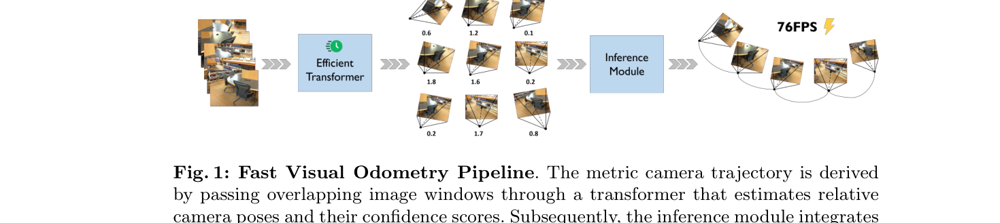
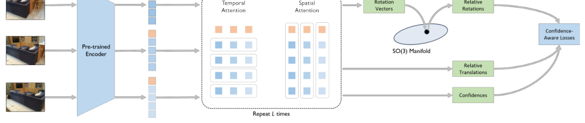
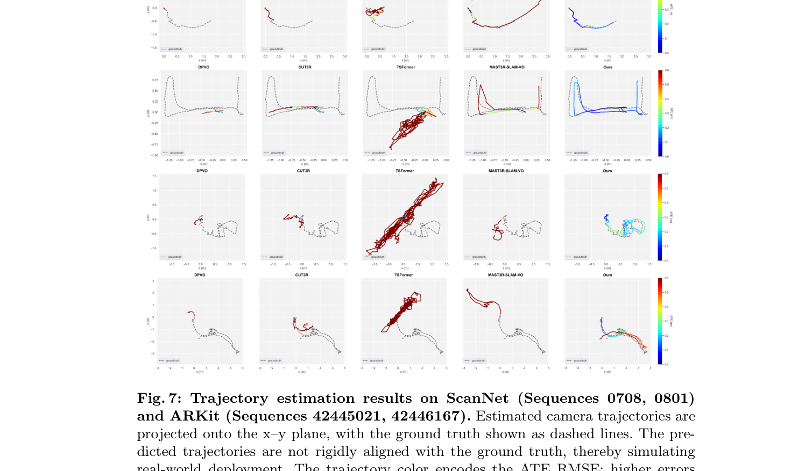

# FVO: Fast Visual Odometry with Transformers

- **Authors**: Vladimir Yugay, Duy-Kien Nguyen, Theo Gevers, Cees G. M. Snoek, Martin R. Oswald
- **Venue/Date**: arXiv 2026 (2026年3月9日公開) / ICLR 2026 (プレプリント)
- **URL**: [https://arxiv.org/abs/2510.03348](https://arxiv.org/abs/2510.03348)
- **GitHub**: [https://vladimiryugay.github.io/fvo](https://vladimiryugay.github.io/fvo)

---

### 1. 背景

従来の単眼ビジュアルオドメトリ（Visual Odometry, VO）システムは、特徴抽出のための深層学習と、**バンドル調整**（Bundle Adjustment, BA）などの古典的な幾何学的最適化を組み合わせたハイブリッドなパイプラインとして構築されてきました。これらは高精度ですが、反復的な最適化プロセスによる計算コストの高さと、外部キャリブレーションなしでは絶対的な物理スケール（Metric Scale）を推定するのが困難であるという 2 つの大きなボトルネックに直面していました。近年、DUSt3R のような大型 3D モデルが幾何学的理解において可能性を示していますが、連続的なビデオストリームには処理速度が遅すぎるか、時間的な一貫性が不足していました。そのため、リアルタイム応用に対応できる、エンドツーエンドで高速な VO システムが切実に求められてきました。

### 2. 直感

混雑した駅を歩いている場面を想像してみてください。目的地にたどり着くために、すべてのレンガや通行人の完璧な 3D マップを作成することはありません。代わりに、周囲の風景が刻一刻と変化する様子を観察することで、自分の相対的な動きを本能的に感知します。さらに重要なのは、自分の目をいつ信じるべきかを知っていることです。例えば、特徴のない白い壁の前を通り過ぎるとき、視覚的な動きの感覚が信頼できないことに気づき、他の手がかりに頼るようになります。FVO は、まさにこの「直感的なナビゲーター」のように機能します。硬直的な幾何学的数学計算の代わりに、フレーム間の相対的な動きを直接「感じ取り」、同時に自身の不確実性を予測するように学習された Transformer を使用します。

### 3. 技術的ブレイクスルー

FVO の決定的な洞察は、ビジュアルオドメトリを直接的な**相対ポーズ回帰**（Relative Pose Regression）問題として定式化し、そこに学習された**異分散不確実性**（Heteroscedastic Uncertainty）を組み合わせたことです。VO を「復元と最適化」の課題として扱うのではなく、FVO は高性能な Transformer を使用して、重なり合う画像ウィンドウをカメラの軌跡に直接マッピングします。この手法の真の強みは、**信頼度を考慮した推論スキーム**（Confidence-aware Inference Scheme）にあります。各相対ポーズに対してモデルがどれだけ確信しているかを予測することで、数百もの重なり合う予測結果を滑らかな広域軌跡へと堅牢に統合することが可能になり、高コストなバンドル調整を単純な重み付き平均化プロセスに置き換えることに成功しました。

### 4. 技術的メカニズム

#### 4.1 パイプライン

- FVO は、効率的な Transformer を介して短く重なり合うビデオウィンドウを処理し、相対ポーズと信頼度スコアを推定します。これらの局所的な推定値は、推論モジュールによって一貫した物理軌跡へと統合されます。
- (1) この図は、生のビデオフレームから統合されたメートル単位のカメラ軌跡への変換プロセスを示しています。 (2) 重なり合うウィンドウにより、モデルは冗長性と信頼度の重み付けを活用して推定値を洗練させることができます。

#### 4.2 アーキテクチャ / 核心設計

- このアーキテクチャは、事前学習済みのエンコーダ（CroCo/DUSt3R 由来）と、時間および空間アテンションブロックを繰り返す**時空間デコーダ**（Time-Space Decoder）で構成されています。学習可能なカメラトークンを使用して、シーケンス全体の情報を統合します。
- (1) この図は、画像ごとのトークン埋め込みから最終的なポーズおよび信頼度ヘッドへの流れを示しています。 (2) 回転を $SO(3)$ 多様体上で予測することで、すべての相対回転が数学的に有効であることを保証します。

#### 4.3 核心となる数式

ネットワークは、回転と並進の両方に対して学習可能な不確実性パラメータ $c\_R, c\_t$ を統合した**確信度認識損失関数**（Confidence-Aware Loss）を用いて学習されます。これにより、モデルはノイズが多い、あるいは信頼性が低いと判断した残差の重みを下げることで「自己較正」を行います。

$$
\mathcal{L} = \mathcal{L}\_{\text{rot}} \exp(-c\_R) + c\_R + \mathcal{L}\_{\text{trans}} \exp(-c\_t) + c\_t
$$

- $\mathcal{L}\_{\text{rot}}$: 予測された回転行列と真値の間の測地線損失 (Eq 9)。
- $\mathcal{L}\_{\text{trans}}$: 予測された相対並進と真値の間の $L1$ 損失 (Eq 10)。
- $c\_R, c\_t$: それぞれ回転と並進の不確実性を表す、学習された対数分散パラメータ (Sec 3.3)。
- $\exp(-c)$: 予測された信頼度に基づいて誤差の重要度を自動的に重み付けする精度項 (Sec 3.3)。

#### 4.4 比較：従来手法 vs 本論文 (証拠に基づく)

FVO は、精度を犠牲にすることなく VO の効率性を飛躍的に向上させました。DPVO のような強力なベースラインが、約 35 FPS に速度を制限する複雑なバンドル調整ループに依存しているのに対し、FVO は同じハードウェアで約 76 FPS（約 2 倍の高速化）を達成しています (Table 1)。長大なシーケンスでスケールの曖昧さやメモリ制限に苦しむ VGGT や MASt3R-SLAM とは異なり、FVO は信頼度を考慮した統合手法を利用して堅牢なメートル軌跡を維持します (Sec 4.1)。ScanNet および ARKit ベンチマークの結果によれば、FVO は最適化を行わないすべてのベースラインの中で絶対軌跡誤差（ATE）において最も優れた性能を示し、最上位のハイブリッド手法とも互角の競争力を維持しています (Table 1)。唯一のトレードオフとして、静的な環境に焦点を当てていることが挙げられ、非常に動的なシーンでの性能は今後の研究課題とされています (Sec 5)。

#### 4.5 定性的結果

ScanNet および ARKit における定性的な軌跡結果は、既存のエンドツーエンドモデルと比較して FVO が優れた堅牢性を備えていることを証明しています。図 7 に見られるように、FVO（シアン色で表示）は、TSFormer や CUT3R といった初期のモデルが大きなドリフト（位置ずれ）を示したり完全に失敗したりする複雑な曲線および直線運動においても、真の軌跡（点線）を正確に追跡しています。特に、FVO はデータセットごとの手動調整なしに、異なるシーケンス間で絶対的な物理スケールを維持することに成功しました。色分けは、FVO が急激な旋回やテクスチャの少ない区間でも ATE RMSE を低く（主に青色の範囲）保っているのに対し、ベースライン手法はしばしば大きな誤差を示す赤色の領域に跳ね上がることを示しています。極端に長距離の軌跡では、わずかな累積ドリフトが依然として観察されることがあります (Fig 7, 最下段)。

### 5. インパクト

FVO は、高速で堅牢、かつキャリブレーション不要な純粋な学習ベースの SLAM システムの新しい時代を切り拓きました。適切に設計された Transformer が古典的な幾何学的最適化ブロックを代替できることを証明したことで、低電力のモバイルデバイスやロボットに高性能な VO を搭載する上での大きな障壁が取り除かれました。そのエンドツーエンドな性質はエンジニアリングスタックを簡素化し、ビジュアルオドメトリを自律走行や拡張現実のためのより広範なマルチモーダル知能システムへ容易に統合することを可能にします。

### 6. 追加資料
[1] [LEVIO: Lightweight Embedded Visual Inertial Odometry for Resource-Constrained Devices (2026)](https://arxiv.org/abs/2602.03294) 
超低電力の組み込みプラットフォームをターゲットに、効率性の限界を追求した高度に最適化された VIO パイプラインの研究です。
[2] [OpenVO: Open-World Visual Odometry with Temporal Dynamics Awareness (2026)](https://arxiv.org/abs/2602.19035) 
ドライブレコーダーの映像など、未校正で未知の環境におけるビジュアルオドメトリを時間的符号化を用いて探求しています。
[3] [MDE-VIO: Enhancing Visual-Inertial Odometry Using Learned Depth Priors (2026)](https://arxiv.org/abs/2602.11323) 
深層学習による深度プライアを伝統的な VIO バックエンドに統合し、低テクスチャ環境での堅牢性を向上させた研究です。
