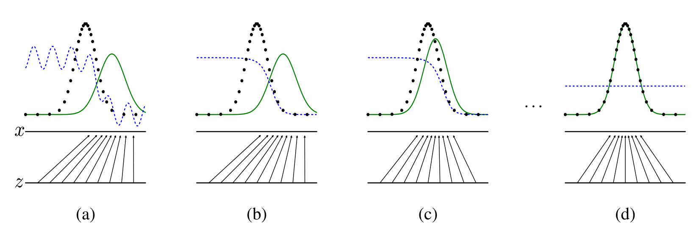
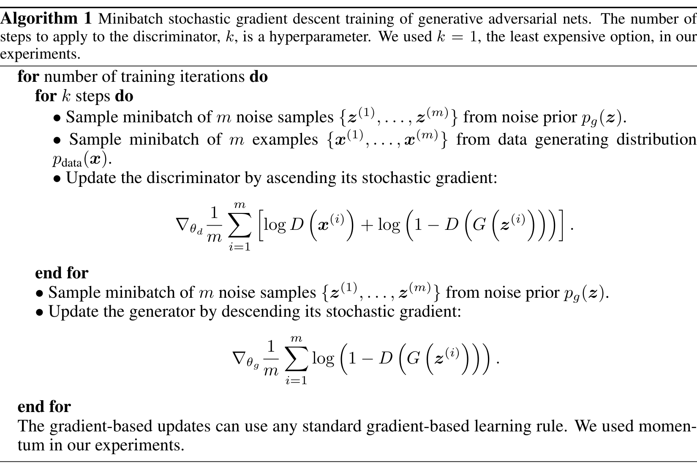
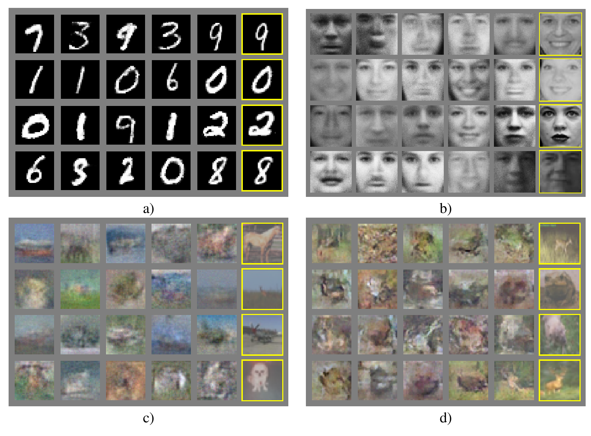

# Generative Adversarial Nets
- **Authors**: Ian J. Goodfellow, Jean Pouget-Abadie, Mehdi Mirza, Bing Xu, David Warde-Farley, Sherjil Ozair, Aaron Courville, Yoshua Bengio
- **Venue/Date**: NeurIPS 2014 (arXiv:1406.2661)
- **URL**: https://arxiv.org/abs/1406.2661
- **GitHub**: https://github.com/goodfeli/adversarial

## 1. Background
- Earlier deep generative models (Boltzmann machines, deep belief nets) required intractable partition functions and slow MCMC inference, while explicit-density models like NADE/RNADE were limited to factorized likelihoods.
- All of them tried to *write down* the data probability and then optimize it, which forced approximations (variational bounds, contrastive divergence). A different route was needed: a model that can be sampled from directly, trained without ever evaluating a likelihood.

## 2. Intuition
- Picture a counterfeiter (Generator $G$) trying to print fake money and a detective (Discriminator $D$) trying to catch fakes. Each round, the detective gets sharper at spotting flaws and the counterfeiter improves to fool the new detective.
- At equilibrium the fakes are statistically indistinguishable from real bills — so the detective is reduced to flipping a coin. No one ever wrote down what "real money" looks like; the model learned it through the rivalry alone.

## 3. Breakthrough
- Replace the intractable likelihood with a *learned* loss. Instead of maximizing $\log p\_{\text{model}}(x)$, train two networks against each other so that their game's saddle point coincides with $p\_g = p\_{\text{data}}$.
- This converts density estimation into a binary classification problem that backpropagation handles natively — and the generator never needs to compute its own probability mass to learn from it.

## 4. Technical Mechanism

### 4.1 Pipeline

- Reading panels (a)→(d) left-to-right shows training progress: dotted curve is $p\_{\text{data}}$, solid green is $p\_g$, dashed blue is $D$. Arrows from $z$ to $x$ depict $G$ pushing the latent prior into data space. As training advances, $p\_g$ overlaps $p\_{\text{data}}$ and $D$ collapses to $\tfrac{1}{2}$ everywhere.
- Key variable: the discriminator $D(x) \in [0,1]$ is the *only* signal the generator ever sees — its gradient through the fake samples drives $G$.

### 4.2 Architecture / Core Design

- The "architecture" is a training loop, not a network diagram: $k$ discriminator updates per single generator update, both via plain SGD on a minibatch of real $x$ and noise $z$ samples.
- Key design choice: the asymmetric $k{:}1$ schedule keeps $D$ near optimal so its gradient remains informative for $G$, while $G$ in practice maximizes $\log D(G(z))$ instead of minimizing $\log(1 - D(G(z)))$ to avoid vanishing gradients early in training.

### 4.3 Core Equation
- The two-player minimax value function — every later GAN variant is a perturbation of this objective.

$$
\min\_G \max\_D V(D, G) = \mathbb{E}\_{x \sim p\_{\text{data}}(x)}[\log D(x)] + \mathbb{E}\_{z \sim p\_z(z)}[\log(1 - D(G(z)))]
$$

- Variables:
  - $D(x)$: discriminator's estimated probability that $x$ is real (Eq 1).
  - $G(z)$: generator mapping a noise sample to data space (Eq 1).
  - $p\_{\text{data}}$: true data distribution; $p\_g$: implicit distribution of $G(z)$ (Sec 3).
  - $p\_z$: fixed noise prior (e.g., uniform or Gaussian) over latent $z$ (Eq 1).

### 4.4 Comparison: Others vs This Paper
The authors argue that adversarial training sidesteps every Achilles' heel of prior generative models. Boltzmann machines need MCMC chains for both training and sampling, and variational autoencoders optimize a lower bound that biases the learned distribution. GANs differ by never representing $p\_g$ explicitly — the network is defined only as a sampler, and its loss is supplied by another network. The mechanism is the minimax game in Eq 1, whose global optimum (proved analytically in Sec 4.1) sits exactly at $p\_g = p\_{\text{data}}$. Empirically this yields sharper samples and competitive Parzen log-likelihoods on MNIST/TFD/CIFAR-10 (Table 1 / Fig 2). The trade-off is well known: no explicit density, no convergence guarantee under finite-capacity networks, and a delicate $k{:}1$ balance that can collapse $G$ onto a few modes.

### 4.5 Qualitative Results

- Each panel shows generator samples in the left columns with the *nearest training example* boxed in yellow on the right — so the eye can verify the model is interpolating, not memorizing. (a) MNIST digits are crisp and stylistically varied; (b) Toronto Face Database faces capture pose and lighting beyond any single training image.
- (c) CIFAR-10 with a fully-connected $G$ degrades to blurry, low-frequency colour blobs, exposing the architecture's limitations on natural images. (d) A convolutional $G/D$ pair produces noticeably more textured animal-like samples — foreshadowing why DCGAN's all-convolutional design (2015) became the next major step.

## 5. Impact
- GANs reframed deep generative modeling as a learnable two-player game and seeded an entire research area: DCGAN, conditional GANs, WGAN, CycleGAN, BigGAN, StyleGAN, and modern image/video synthesis pipelines all trace back to this objective.
- Beyond images, the adversarial principle reshaped representation learning, domain adaptation, and ultimately influenced diffusion-model training and evaluation (FID is computed on a discriminator-style classifier).

## 6. Further Reading
[1] [Unsupervised Representation Learning with Deep Convolutional Generative Adversarial Networks (2015)](https://arxiv.org/abs/1511.06434) 
DCGAN — the all-convolutional architecture and training tricks that made GAN images consistently sharp. 
[2] [Conditional Generative Adversarial Nets (2014)](https://arxiv.org/abs/1411.1784) 
Adds a conditioning input $y$ to both $G$ and $D$, enabling class-conditional and image-to-image generation. 
[3] [Wasserstein GAN (2017)](https://arxiv.org/abs/1701.07875) 
Replaces the Jensen–Shannon objective with the Earth-Mover distance to fix vanishing gradients and mode collapse. 
[4] [A Style-Based Generator Architecture for Generative Adversarial Networks (2018)](https://arxiv.org/abs/1812.04948) 
StyleGAN — disentangled style/content control that pushed photorealistic face synthesis to its modern peak. 
[5] [Auto-Encoding Variational Bayes (2013)](https://arxiv.org/abs/1312.6114) 
The contemporaneous VAE — the "explicit density" alternative against which GANs are most often benchmarked. 
