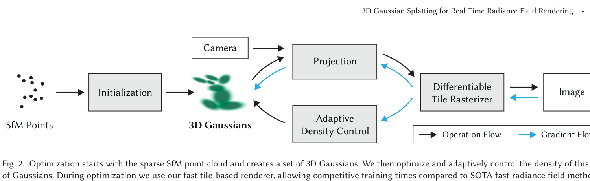
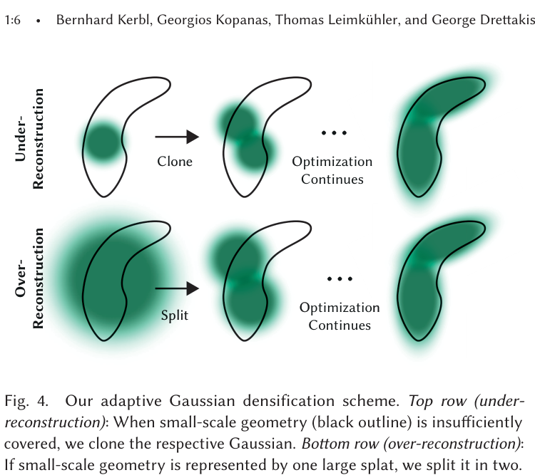
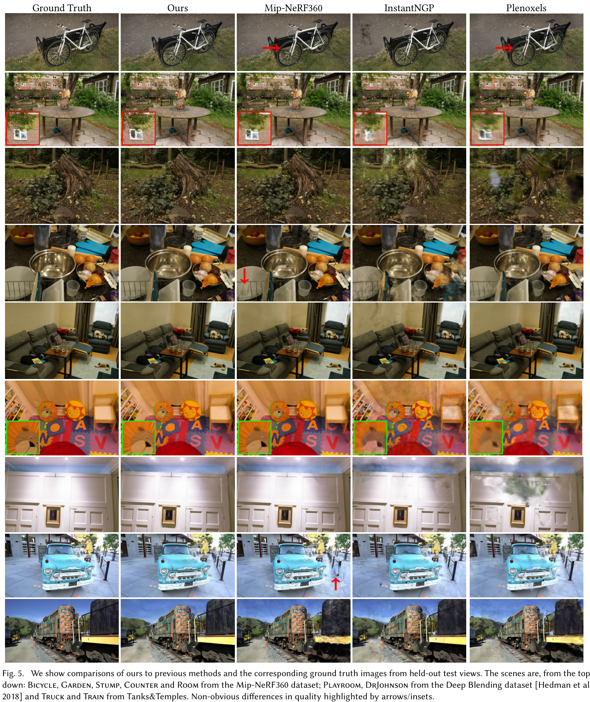

# リアルタイム・ラディアンスフィールド・レンダリングのための 3D Gaussian Splatting

- **著者**: Bernhard Kerbl, Georgios Kopanas, Thomas Leimkühler, George Drettakis
- **発表学会/時期**: SIGGRAPH 2023 / 2023年8月
- **URL**: [https://arxiv.org/abs/2308.04079](https://arxiv.org/abs/2308.04079)
- **GitHub**: [https://github.com/graphdeco-inria/gaussian-splatting](https://github.com/graphdeco-inria/gaussian-splatting)

---

### 1. 背景 (Background)
従来の Neural Radiance Fields (NeRF) は、密度と色を連続的なボリューム関数（MLP）で表現することで、3D シーン再構成に革命をもたらしました。しかし、NeRF はレンダリング時に 1 ピクセルあたり数千回ものニューラルネットワーク・クエリを必要とするため、リアルタイムレンダリングが極めて困難でした。近年の Instant-NGP や Plenoxels などの手法がグリッド構造を利用して速度を改善しましたが、複雑で大規模なシーンの微細なディテールや背景の表現には課題が残っていました。つまり、「最高レベルの画質」と「リアルタイムの対話性」の両立を可能にする新しいアプローチが求められていました。

### 2. 直感的理解 (Intuition)
あなたが 3D シーンを描く画家だと想像してください。3D グリッドのすべての点に色を塗ったり（ボクセル）、複雑な数式一つでシーン全体を説明しようとする（NeRF）代わりに、ふわっとした半透明の**「スプレーペイントの跡」**(3D Gaussians) を数百万個使ってシーンを構成すると考えてみましょう。ある点は丸く、ある点はテーブルの端や葉の表面に沿って針のように細長く伸びています（異方性）。これらの数百万個の色付き「スプラット (splats)」を重ね合わせることで、どんな角度からでも複雑なシーンを非常に素早く再現できます。これは従来の CG で三角形を描画するように高速でありながら、写真のような滑らかさと詳細さを兼ね備えています。

### 3. 画期的なポイント (Breakthrough)
この論文の核心は、NeRF のコストのかかる「ボリューム・レイマーチング (Volumetric Ray-marching)」を、**微分可能な 3D Gaussian Splatting** と高性能な **タイルベース・ラスタライザ (Tile-based Rasterizer)** に置き換えたことです。シーンを 2D に投影可能な数百万個の明示的な楕円体の集合として表現することで、ハードウェア加速によるソートとブレンディングが可能になりました。この「関数をクエリする方式（暗黙的）」から「幾何学的な基本単位を描画する方式（明示的）」への転換により、最高峰の NeRF モデルに匹敵する画質を維持しながら、秒間 100 フレーム以上の高速レンダリングを実現しました。

### 4. 技術的メカニズム (Technical Mechanism)

#### 4.1 パイプライン (Pipeline)

- ワークフローは、SfM (Structure-from-Motion) によって得られた疎なポイントクラウドから始まり、これを 3D ガウスの集合に変換します。これらのガウスは、リアルタイムのフィードバックが可能なタイルベースの微分可能ラスタライザを通じて、位置、回転、スケール、不透明度、および色（球面調和関数）が最適化されます。
- (1) この図は、疎な入力ポイントから高密度で最適化されたラディアンスフィールドへのエンドツーエンドの遷移を示しています。(2) シーンの隙間を埋めるために不可欠な「適応型密度制御 (Adaptive Density Control)」のステップに注目してください。

#### 4.2 アーキテクチャ / コアデザイン (Architecture / Core Design)

- システムの核心ロジックは **適応型ガウス高密度化 (Adaptive Gaussian Densification)** です。ガウスの数を固定せず、シーンが複雑で再構成が不足している部分に動的に「スプラット」を追加します。空いたスペースを埋めるために小さなガウスを「複製 (Clone)」したり、ぼやけた大きなガウスをより小さく鋭い複数のガウスに「分割 (Split)」したりすることで、非常に微細なディテールを捉えます。
- (1) この図は、モデルがどのように「再構成不足 (Under-Reconstruction)」と「過剰再構成 (Over-Reconstruction)」の領域を識別するかを説明しています。(2) 「分割」と「複製」の操作により、モデルはシーンの複雑さに合わせて解像度を自動的に調整します。

#### 4.3 コア方程式 (Core Equation)
- **選定理由**: この方程式は、3D ガウスの形状（共分散行列）をどのようにパラメータ化し、勾配降下法で安全に最適化しながら、物理的に妥当な形状（正定値行列）を維持するかを説明しています。
- **方程式**: $\Sigma = R S S^T R^T$
- この公式は、ガウス楕円体の形状を「引き伸ばし（スケーリング $S$）」と「方向（回転 $R$）」という 2 つの独立した要素に分解します。
- **変数の説明**:
  - $\Sigma$ = ガウスの形状とサイズを表す 3D 共分散行列。
  - $R$ = 最適化された単位四元数 (quaternion) $q$ から導出される回転行列。
  - $S$ = 最適化された 3D ベクトル $s$ から導出されるスケーリング行列。

#### 4.4 比較分析：従来手法 vs 本論文 (Comparison)
3D Gaussian Splatting は、暗黙的なニューラルボリュームから、明示的なポイントベース・スプラッティングへのパラダイムシフトを意味します。最も強力なベースラインである Mip-NeRF360 は優れた画質を提供しますが、1 フレームのレンダリングに数分を要します。対照的に、本手法はリアルタイム性を達成しながら、同等以上の画質を実現しました (Sec 7.1)。MVS ベースの形状手法から脱却し、異方性ガウスを選択することで、従来のポイントベース・レンダリングによく見られるアーティファクト (Fig 11) を回避し、高密度グリッドの学習オーバーヘッドを削減しました。主なトレードオフは、数百万個のガウスを保存するためのメモリ要件で、複雑なシーンでは数ギガバイトに達することがあります (Sec 7.5)。

#### 4.5 定性的結果 (Qualitative Results)

結果として、自転車のスポークや庭の葉のような細く繊細な構造の再構成能力において圧倒的な性能を示しています。Instant-NGP などの従来手法がしばしばぼやけたり「ピクセル化」したようなアーティファクトを生じるのと対照的です。Mip-NeRF360 と並べて比較しても、シャープさや視点依存の反射の面で目視での区別が困難なほど優れています。「Bicycle」や「Garden」のシーンで見られるように、金属表面の鏡面ハイライトや自然物の複雑な質感を Plenoxels よりもはるかに良く保存しています (Table 1 / Fig 5)。制限としては、視点依存効果が十分に収束していない非常に疎な領域において、稀に「針状」のアーティファクトが発生することが指摘されています。

### 5. 影響と展望 (Impact)
この論文は、高品質なラディアンスフィールド研究における「レンダリングが遅い」時代を事実上終わらせました。リアルタイムかつ微分可能なラスタライゼーション・パイプラインを提供したことで、VR、デジタルツイン、リアルタイムのシネマティック・レンダリングといった応用分野への道を開きました。3D Gaussian Splatting は、それ以来、明示的なラディアンスフィールド研究のデファクト・スタンダードとなり、圧縮、アニメーション、大規模マッピングを対象とした数十のフォローアップ研究を生み出しました。

### 6. さらに読む (Further Reading)
- [SuGaR: Surface-Aligned Gaussian Splatting](https://arxiv.org/abs/2311.16523) - ガウスをシーン表面に整列させて高品質なメッシュを抽出する手法。
- [4D Gaussian Splatting for Real-Time Dynamic Scene Rendering](https://arxiv.org/abs/2310.08585) - 動的なオブジェクトを含むシーンへと表現を拡張した手法。
- [GaussianPro: 3D Gaussian Splatting with Progressive Propagation](https://arxiv.org/abs/2402.14650) - 複雑な形状に対してより良い品質を得るための密度制御メカニズムの改善。
- [Compact 3D Gaussian Splatting](https://arxiv.org/abs/2311.13681) - メモリのボトルネックを解消するためのガウス表現の圧縮。
- [Zip-NeRF: Anti-Aliased Grid-Based Neural Radiance Fields](https://arxiv.org/abs/2304.06706) - 並行して発表された手法だが、グリッドベース NeRF の頂点として比較対象として重要。
