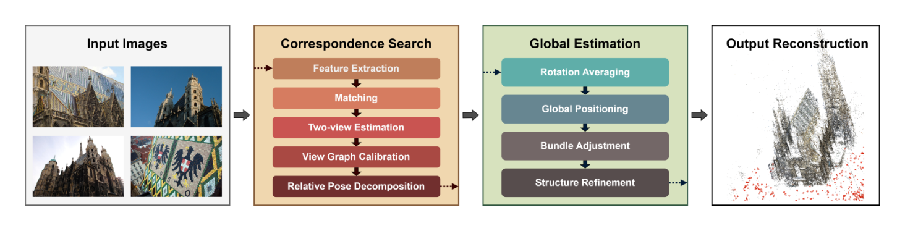
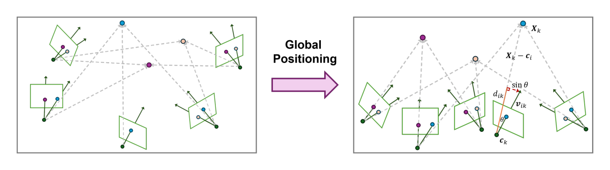
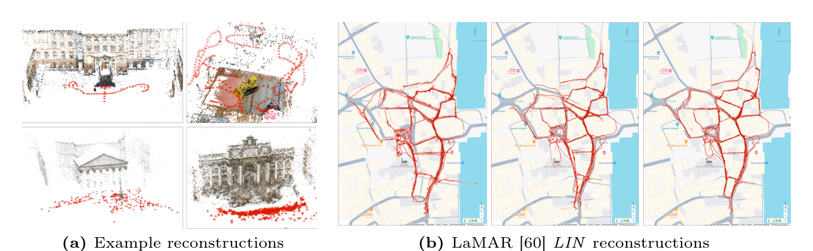

# Global Structure-from-Motion Revisited
- **Authors**: Linfei Pan, Dániel Baráth, Marc Pollefeys, Johannes L. Schönberger
- **Venue/Date**: arXiv 2024
- **URL**: [https://arxiv.org/abs/2407.20219](https://arxiv.org/abs/2407.20219)
- **GitHub**: [https://github.com/colmap/glomap](https://github.com/colmap/glomap)

---

### 1. Background
Structure-from-Motion (SfM) is the process of reconstructing 3D structures and camera poses from multiple images. Traditional approaches are divided into **incremental SfM**, which is accurate but slow due to repeated optimizations (Bundle Adjustment), and **global SfM**, which is fast but prone to failure. The main weakness of global SfM lies in the "translation averaging" step, where camera positions are estimated from relative directions. This step is often ill-posed, highly sensitive to noise in camera intrinsics, and fails under common motion patterns like co-linear (straight-line) movement.

### 2. Intuition
Imagine trying to assemble a large, complex Lego model. Incremental SfM is like adding one piece at a time and checking the alignment every single step—it's very precise but takes forever. Traditional global SfM is like building all the small sub-sections separately and then trying to snap them all together based only on the directions they point—if one direction is slightly off, the whole model breaks. **GLOMAP**'s intuition is to place both the pieces (cameras) and the studs they connect to (3D points) simultaneously in one go. By anchoring the cameras directly to the 3D points during the positioning phase, the system becomes much more stable and accurate, similar to how a skeleton holds a body together.

### 3. Breakthrough
The core breakthrough of GLOMAP is the introduction of a **Joint Global Positioning** step. Instead of following the standard global SfM sequence of "Rotation Averaging $\rightarrow$ Translation Averaging $\rightarrow$ Triangulation," GLOMAP performs **Joint Camera and Point Position Estimation**. By discarding the problematic relative translation constraints and instead optimizing camera rays and 3D points together, the method handles unknown camera intrinsics and degenerate motion patterns far more robustly than previous global methods, effectively bridging the gap to incremental SfM's accuracy.

### 4. Technical Mechanism

#### 4.1 Pipeline

- The pipeline begins with feature matching and two-view geometry verification, followed by rotation averaging to find camera orientations. The core innovation occurs in the **Global Positioning** stage, where camera positions and 3D point positions are solved jointly before final refinement.
- (1) Overview of the end-to-end GLOMAP system architecture. (2) The "Global Positioning" module (Section 3.2) is the key differentiator from traditional pipelines.

#### 4.2 Architecture / Core Design

- This figure illustrates the transition from a random initial state to a structured 3D configuration. By minimizing the angular differences between observed camera rays ($v_{ik}$) and the calculated vectors between cameras and points, the system converges to a globally consistent geometry.
- (1) Visualization of the Global Positioning optimization process. (2) The use of ray-based constraints instead of relative translations allows for more robust convergence.

#### 4.3 Core Equation
- **Selection criteria**: Equation (3) is the primary optimization objective that enables the joint estimation of cameras and points, which is the defining characteristic of GLOMAP.
- **Equation**:
  
  $$\underset{\mathbf{X}, \mathbf{c}, \mathbf{d}}{\arg\min} \sum_{i,k} \rho (\|\mathbf{v}_{ik} - d_{ik}(\mathbf{X}_k - \mathbf{c}_i)\|^2), \text{ subject to } d_{ik} \ge 0$$
  
- The formula represents a weighted minimization of the distance between the observed directional ray and the vector connecting the camera to the point.
- **Variables**: 
  - $\mathbf{X}_k$: The 3D position of the $k$-th feature track (Section 3.2).
  - $\mathbf{c}_i$: The 3D position of the $i$-th camera (Section 3.2).
  - $\mathbf{v}_{ik}$: The globally rotated camera ray for observation $(i, k)$ (Equation 3).
  - $d_{ik}$: A per-observation scaling factor that accounts for the unknown distance to the point (Equation 3).
  - $\rho$: The Huber robustifier used to mitigate the impact of outlier matches (Section 3.2).

#### 4.4 Comparison: Others vs This Paper (Evidence-Based)
GLOMAP achieves a level of accuracy and robustness that is on par with or superior to COLMAP, the most widely used incremental SfM system, while operating orders of magnitude faster. Unlike previous global SfM systems like Theia, which often fail on internet photo collections with unknown intrinsics or sequential data, GLOMAP handles these scenarios reliably by avoiding the ill-posed translation averaging step. Specifically, on the IMC 2023 dataset, it produced results with significantly higher AUC scores than other global baselines while being approximately 8 times faster than COLMAP (Section 4.2 / Table 5). The paper differentiation lies in its ability to maintain the scalability of global methods without sacrificing the reconstruction quality of incremental approaches.

#### 4.5 Qualitative Results (When Applicable)

The qualitative results demonstrate GLOMAP's capability to produce dense and accurate 3D reconstructions across diverse datasets, ranging from internet photo collections to structured sequential captures. When compared side-by-side on the LaMAR dataset, GLOMAP successfully reconstructs complex scenes where current global baselines like Theia fail to produce a coherent model, and even exceeds the completeness of incremental systems like COLMAP (Fig. 1b). The visual evidence shows that GLOMAP produces fewer artifacts and more complete geometric structures, particularly in large-scale environments. This robustness is attributed to its joint optimization strategy which better handles noise and scale inconsistencies.

### 5. Impact
GLOMAP reshapes the SfM landscape by proving that global approaches can be as reliable as incremental ones for general-purpose use. This is a major leap for large-scale 3D mapping, as it enables the processing of thousands of images in minutes rather than hours, without the typical risk of reconstruction failure. Open-sourced as part of the COLMAP ecosystem, it is poised to become a standard tool for computer vision researchers and engineers working on novel-view synthesis (like NeRF and Gaussian Splatting) and large-scale digital twins.

### 6. Further Reading
[1] [FastMap: Revisiting Structure from Motion through First-Order Optimization (2025)](https://arxiv.org/abs/2505.04612) 
A 2025 follow-up that uses first-order optimization to achieve up to 10x faster speeds than GLOMAP.

[2] [Gravity-Aligned Rotation Averaging with Circular Regression (2024)](https://arxiv.org/abs/2410.12763) 
A 2024 work by GLOMAP authors that incorporates gravity priors to further improve rotation averaging.

[3] [MP-SfM: Monocular Surface Priors for Robust Structure-From-Motion (2025)](https://arxiv.org/abs/2504.20040) 
A 2025 paper exploring the use of monocular surface priors to enhance SfM robustness in difficult scenes.
