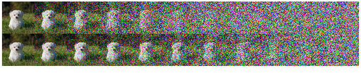
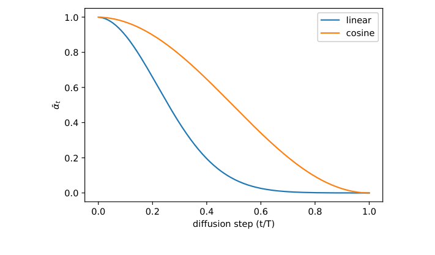
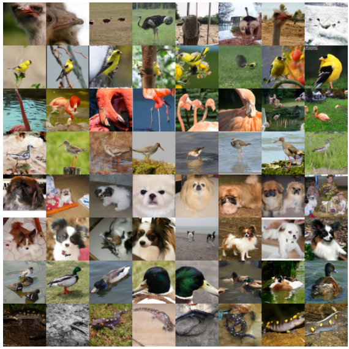

# Improved Denoising Diffusion Probabilistic Models

- **Authors**: Alex Nichol, Prafulla Dhariwal
- **Venue/Date**: arXiv 2021
- **URL**: [https://arxiv.org/abs/2102.09672](https://arxiv.org/abs/2102.09672)
- **GitHub**: [https://github.com/openai/improved-diffusion](https://github.com/openai/improved-diffusion)

---

### 1. Background
DDPM showed that diffusion models could produce high-quality images, but it left two practical problems. First, likelihood was not competitive with strong likelihood-based models. Second, sampling was slow because generation required a long chain of reverse denoising steps. The original DDPM also fixed the reverse-process variance, which was adequate for sample quality but limited likelihood and fast sampling. This paper asks how much can be gained from small, targeted changes to the diffusion process rather than a completely new model family.

### 2. Intuition
Think of DDPM as a long image restoration recipe with thousands of tiny instructions. The original recipe decides in advance how uncertain each reverse step should be. Improved DDPM lets the model learn part of that uncertainty, so it can take larger and better-calibrated steps when sampling. It also changes how noise is added over time: instead of destroying useful signal too early, the cosine schedule spreads the corruption more evenly. The result is the same basic recipe, but with better step sizes and a better clock.

### 3. Breakthrough
The breakthrough is that three simple engineering changes make DDPMs much more practical. The model learns reverse-process variances using a stable interpolation between two known variance bounds. Training uses a hybrid objective that keeps the strong sample quality of the simplified DDPM loss while still giving the variance head a variational learning signal. The paper also replaces the linear noise schedule with a cosine schedule, making later diffusion steps less wasted. Together, these changes improve likelihood and allow high-quality samples with far fewer sampling steps.

### 4. Technical Mechanism

#### 4.1 Pipeline

- (1) The figure compares how latent images degrade under the linear schedule and the cosine schedule. The cosine schedule preserves useful image structure for longer instead of turning late timesteps into pure noise too early. (2) The key variable is $\bar{\alpha}\_t$, which controls how much original signal remains at timestep $t$.

#### 4.2 Architecture / Core Design

- (1) The schedule figure shows the same design choice numerically: the cosine schedule decreases signal more smoothly than the linear schedule. (2) The core design is to improve the diffusion process itself, while keeping the DDPM denoising architecture mostly intact.

#### 4.3 Core Equation
- The key variance parameterization learns an interpolation between the two natural reverse-variance bounds:

$$
\Sigma_\theta(x_t,t) = \exp\left(v\log\beta_t + (1-v)\log\tilde{\beta}_t\right)
$$

- Variables:
  - $x\_t$: the noisy sample at timestep $t$.
  - $\Sigma\_\theta(x\_t,t)$: the model's learned reverse-process variance.
  - $v$: the model output used to interpolate between variance bounds.
  - $\beta\_t$: the forward-process noise variance at timestep $t$.
  - $\tilde{\beta}\_t$: the posterior variance from the exact reverse distribution when $x\_0$ is known.
  - $t$: the diffusion step, shared by the denoising and variance predictions.

#### 4.4 Comparison: Others vs This Paper
The paper's claim is that DDPM can be made faster and more likelihood-competitive with small process-level changes. Original DDPM fixed reverse variances and used a linear noise schedule, which preserved sample quality but left likelihood and sampling efficiency on the table. Improved DDPM learns variances, uses a hybrid objective, and adopts a cosine schedule (Secs. 3.1 and 3.2). Experiments show better ImageNet 64 x 64 likelihood than the baseline, smoother scaling with compute, and near-optimal FID with about 100 sampling steps for fully trained models (Fig. 8). The trade-off is that optimizing pure VLB can improve likelihood further but tends to hurt FID, so the paper often prefers the hybrid objective.

#### 4.5 Qualitative Results

The qualitative figure shows class-conditional ImageNet 64 x 64 samples generated with 250 sampling steps from the hybrid-objective model. The samples cover many visual modes: birds, dogs, ducks, salamanders, and other classes appear with distinct shapes and textures. This supports the paper's precision-recall point: diffusion models can cover the target distribution broadly rather than only sharpening a narrow subset of modes.

The figure is also important because it comes from a faster sampler than the original long DDPM chain. The samples are not merely a likelihood improvement on paper; they show that learned variance and the improved process can preserve visible image quality while reducing sampling cost.

### 5. Impact
Improved DDPM turned diffusion from a promising but slow image generator into a more practical and scalable modeling recipe. Learned variance, hybrid objectives, cosine schedules, and step respacing became standard components in later diffusion codebases. The paper also helped make precision and recall part of the diffusion-versus-GAN comparison, emphasizing distribution coverage rather than only FID. Later high-quality diffusion systems build on this lesson: better schedules and sampling parameterization can matter as much as larger networks.

### 6. Further Reading
[1] [Denoising Diffusion Probabilistic Models (2020)](https://arxiv.org/abs/2006.11239) 
Introduces the baseline DDPM recipe that this paper improves with learned variance, schedule changes, and a hybrid objective. 
[2] [Denoising Diffusion Implicit Models (2020)](https://arxiv.org/abs/2010.02502) 
Provides an alternative route to faster diffusion sampling through non-Markovian reverse trajectories. 
[3] [Score-Based Generative Modeling through Stochastic Differential Equations (2021)](https://arxiv.org/abs/2011.13456) 
Connects diffusion models to continuous-time score-based SDE and ODE sampling views. 
[4] [Diffusion Models Beat GANs on Image Synthesis (2021)](https://arxiv.org/abs/2105.05233) 
Extends improved diffusion ideas with architectural changes and classifier guidance for stronger ImageNet generation. 
[5] [High-Resolution Image Synthesis with Latent Diffusion Models (2022)](https://arxiv.org/abs/2112.10752) 
Moves diffusion into autoencoder latent space to reduce high-resolution generation cost. 
[6] [Classifier-Free Diffusion Guidance (2022)](https://arxiv.org/abs/2207.12598) 
Replaces classifier-based guidance with a simpler conditional and unconditional score mixing rule. 
