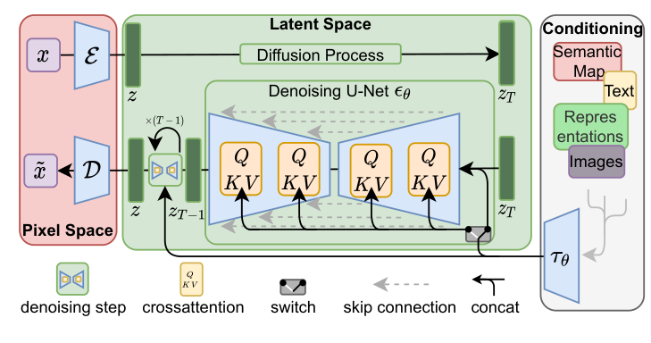
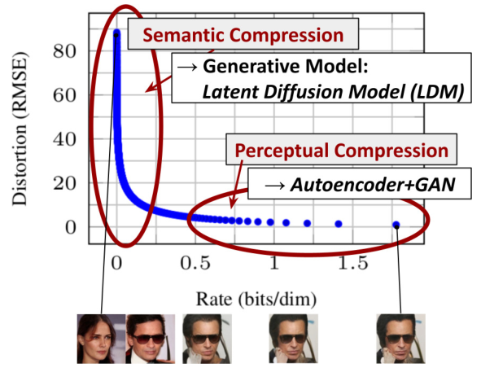
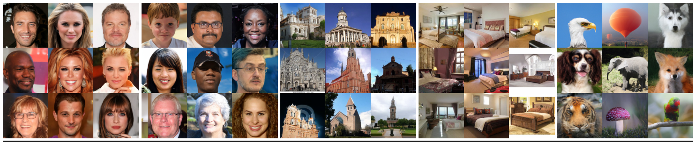

# High-Resolution Image Synthesis with Latent Diffusion Models

- **Authors**: Robin Rombach, Andreas Blattmann, Dominik Lorenz, Patrick Esser, Björn Ommer
- **Venue/Date**: CVPR 2022
- **URL**: [https://arxiv.org/abs/2112.10752](https://arxiv.org/abs/2112.10752)
- **GitHub**: [https://github.com/CompVis/latent-diffusion](https://github.com/CompVis/latent-diffusion)

---

### 1. Background
Diffusion models had already shown strong image synthesis quality, but they were expensive because they usually denoised directly in pixel space. A high-resolution image has many pixels, and every sampling step runs a large neural network on that full representation. Training could consume hundreds of GPU days, and inference required many sequential model evaluations. The practical question was clear: can diffusion keep its quality and flexible conditioning while avoiding the full cost of pixel-space generation?

### 2. Intuition
LDM treats image generation like drafting a picture in a compact sketch space before rendering the final canvas. Instead of asking the diffusion model to manipulate every pixel, it first compresses the image through an autoencoder. The diffusion model then learns to denoise the latent code, where the spatial grid is smaller but still preserves perceptual content. After denoising is finished, the decoder converts the latent result back into pixels. This keeps the semantic work inside diffusion while moving low-level pixel detail reconstruction to the autoencoder.

### 3. Breakthrough
The breakthrough is the operating point between compression and fidelity. Earlier compression can remove too much detail, while pixel-space diffusion keeps too much irrelevant signal and becomes expensive. LDM trains a perceptual autoencoder and runs diffusion in its latent space, so the model avoids imperceptible pixel-level redundancy without losing the structure needed for high-quality synthesis. The paper also adds cross-attention conditioning, turning the same latent diffusion backbone into a flexible generator for text, layouts, semantic maps, inpainting, and super-resolution.

### 4. Technical Mechanism

#### 4.1 Pipeline

- (1) The pipeline has three stages: encode an image into latent space with $E$, run the denoising U-Net on latent variables $z\_t$, and decode the final latent sample with $D$. (2) The key variable is $z\_t$, not $x\_t$: diffusion happens on a compressed latent grid, while the decoder handles the final pixel reconstruction.

#### 4.2 Architecture / Core Design

- (1) The figure shows why the latent space is useful: most pixel bits are visually unimportant, while semantic content survives strong perceptual compression. (2) LDM chooses a compression level that reduces compute while preserving enough detail for the diffusion model to synthesize realistic images.

#### 4.3 Core Equation
- The LDM objective is the DDPM noise-prediction loss moved from pixels into autoencoder latent space:

$$
L_{\mathrm{LDM}} := \mathbb{E}_{E(x), \epsilon \sim \mathcal{N}(0,1), t}\left[\left\|\epsilon - \epsilon_\theta(z_t,t)\right\|_2^2\right]
$$

- Variables:
  - $x$: the original image from the training set.
  - $E(x)$: the encoder output, used as the clean latent representation $z$.
  - $z\_t$: the noisy latent at diffusion timestep $t$.
  - $\epsilon$: Gaussian noise added during the forward diffusion process.
  - $\epsilon\_\theta(z\_t,t)$: the U-Net prediction of the noise in latent space.
  - $D(z)$: the decoder that maps the denoised latent back to image pixels.

#### 4.4 Comparison: Others vs This Paper
Pixel-space DDPMs model the full image directly. That is simple and expressive, but expensive because every denoising step operates at image resolution. GAN-based autoencoders can compress images efficiently, but they do not provide diffusion's stable likelihood-style training and iterative refinement. LDM combines the two: the autoencoder handles perceptual compression, and diffusion handles generative modeling in the compressed space. Compared with pixel diffusion, this gives a much better speed-quality tradeoff. Compared with pure compression models, it keeps the strong sample quality and conditioning flexibility of diffusion.

#### 4.5 Qualitative Results

The qualitative samples show that the latent model is not just reconstructing blurry sketches. It generates detailed faces, churches, bedrooms, and ImageNet objects at 256 x 256 resolution. This matters because aggressive latent compression could have destroyed high-frequency realism. The figure supports the paper's central claim: a properly chosen latent space can remove computational waste while still leaving enough information for high-fidelity generation.

### 5. Impact
LDM became one of the key design patterns behind modern text-to-image systems. Its main lesson is that diffusion does not have to spend all of its modeling capacity in pixel space. By separating perceptual compression from generative denoising, it made high-resolution diffusion more practical and easier to condition on text or other structured inputs. This idea directly shaped the Stable Diffusion family and made open, high-resolution diffusion models feasible on widely available hardware.

### 6. Further Reading
[1] [Denoising Diffusion Probabilistic Models (2020)](https://arxiv.org/abs/2006.11239) 
Defines the DDPM training objective that LDM reuses inside latent space. 
[2] [Denoising Diffusion Implicit Models (2020)](https://arxiv.org/abs/2010.02502) 
Introduces deterministic and accelerated diffusion sampling, which is commonly used with latent diffusion checkpoints. 
[3] [GLIDE: Towards Photorealistic Image Generation and Editing with Text-Guided Diffusion Models (2021)](https://arxiv.org/abs/2112.10741) 
Shows strong text-guided diffusion before LDM became the dominant efficient high-resolution route. 
[4] [Hierarchical Text-Conditional Image Generation with CLIP Latents (2022)](https://arxiv.org/abs/2204.06125) 
Explores text-to-image generation through a hierarchy of CLIP latent prediction and image decoding. 
[5] [Photorealistic Text-to-Image Diffusion Models with Deep Language Understanding (2022)](https://arxiv.org/abs/2205.11487) 
Demonstrates the value of large language encoders for text-conditioned diffusion generation. 
[6] [Classifier-Free Diffusion Guidance (2022)](https://arxiv.org/abs/2207.12598) 
Formalizes a guidance method that became central to controllable and high-fidelity diffusion sampling. 
