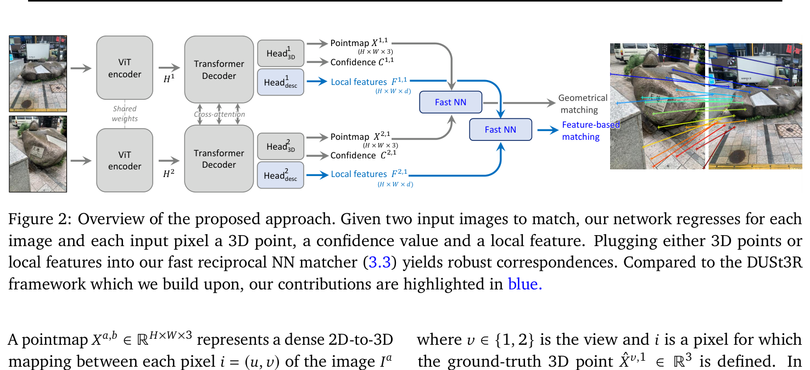
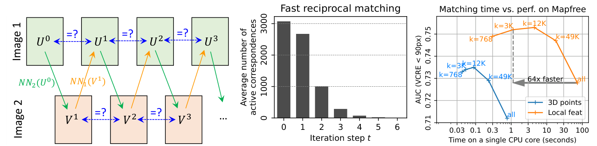
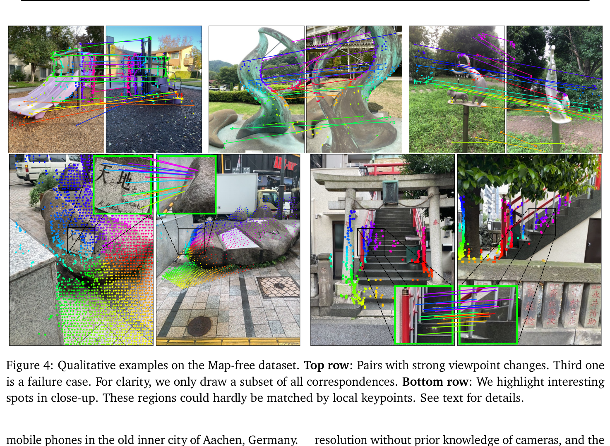

# MASt3R: Grounding Image Matching in 3D with MASt3R
- **Authors**: Vincent Leroy, Yohann Cabon, Jerome Revaud
- **Venue/Date**: ECCV 2024 / June 14, 2024
- **URL**: [https://arxiv.org/abs/2406.09756](https://arxiv.org/abs/2406.09756)
- **GitHub**: [https://github.com/naver/mast3r](https://github.com/naver/mast3r)

---

### 1. Background
Modern 3D vision relies heavily on **image matching** (finding the same point in two images). Traditionally, this is treated as a 2D problem—searching for similar-looking patches. However, matching is intrinsically linked to 3D geometry and camera poses. While recent foundations like **DUSt3R** successfully regressed 3D pointmaps directly from images, they lacked the precision needed for fine-grained matching. DUSt3R's "blind" regression of 3D coordinates is robust to viewpoint changes but fails to capture the pixel-accurate details required for high-fidelity reconstruction and localization.

### 2. Intuition
Imagine you are looking at a complex sculpture from two completely different sides. A 2D "patch matcher" would give up because the colors and shapes look different. But a **3D-aware observer** understands that a specific decorative swirl on the left is the *same physical object* as the swirl seen from the right, regardless of its appearance. MASt3R acts like this observer: it doesn't just guess where things are in 3D; it builds a bridge between "what it looks like" (local features) and "where it is in space" (3D geometry).

### 3. Breakthrough
The key "Aha!" moment in MASt3R is the addition of a dedicated **matching head** to the DUSt3R architecture. Instead of just predicting 3D coordinates, the network now simultaneously outputs **dense local descriptors**. These descriptors are explicitly trained to be similar for the same physical points and different for others (using a contrastive loss). By grounding these features in a 3D-heavy backbone, the model achieves the robustness of 3D regression with the precision of classical local feature matching.

### 4. Technical Mechanism

#### 4.1 Pipeline

- The pipeline starts with a Siamese ViT encoder processing two images, followed by a Transformer decoder with cross-attention that allows the views to interact.
- (1) The output flows through dual heads: a 3D head for pointmaps and a new descriptor head for dense features, (2) which are then fed into a fast reciprocal matcher to produce robust 3D correspondences.

#### 4.2 Architecture / Core Design

- The architecture introduces a **Fast Reciprocal Matching** scheme to solve the quadratic complexity problem ($O(N^2)$) of dense matching.
- (1) It iteratively sub-samples candidate matches and converges to stable reciprocal pairs, (2) accelerating the process by orders of magnitude while preserving accuracy on high-resolution images.

#### 4.3 Core Equation
To train the new matching head, MASt3R uses an **InfoNCE matching loss**, which forces the descriptors of corresponding points to be as similar as possible.

- **Equation**:

$$ \mathcal{L}_{\text{match}} = - \sum_{(i,j) \in \hat{\mathcal{M}}} \left( \log \frac{s_{\tau}(i,j)}{\sum_{k \in \mathcal{P}^1} s_{\tau}(k,j)} + \log \frac{s_{\tau}(i,j)}{\sum_{k \in \mathcal{P}^2} s_{\tau}(i,k)} \right) $$

- **Variables**:
  - $(i,j) \in \hat{\mathcal{M}}$: A ground-truth corresponding pair of pixels between images 1 and 2.
  - $s_{\tau}(i,j) = \exp \left[ -\tau D_i^{1\top} D_j^2 \right]$ (Eq 11): The similarity score between local descriptors $D_i^1$ and $D_j^2$.
  - $\tau$: A temperature hyper-parameter that controls the "sharpness" of the matching distribution.
  - $\mathcal{P}^1, \mathcal{P}^2$: The sets of all considered pixels in image 1 and image 2, respectively.

#### 4.4 Comparison: Others vs This Paper
MASt3R represents a significant leap over DUSt3R and 2D-only matchers like LoFTR by unifying 3D regression and feature matching. While DUSt3R provides robustness but low precision, and LoFTR provides precision but struggles with extreme viewpoint changes, MASt3R excels in both. It achieves a 30% absolute improvement in VCRE AUC on the challenging Map-free localization dataset (Sec 4.2 / Table 2). The differentiator is the explicit matching head grounded in 3D geometry. One trade-off is that high-resolution images still require a coarse-to-fine or windowing strategy due to ViT memory limits (Sec 3.4).

#### 4.5 Qualitative Results

The qualitative results show MASt3R's ability to find dense and accurate correspondences even under extreme viewpoint changes (up to 180 degrees). In the top row of Figure 4, we see successful matches on complex outdoor scenes where traditional methods would likely fail due to drastic perspective shifts. The bottom row highlights how MASt3R captures intricate details in close-ups, such as text on a stone or specific cultural artifacts, demonstrating both global robustness and local precision. Even in difficult cases with low texture or repetitive patterns, the 3D-grounded features provide stable matches (Figure 4).

### 5. Impact
MASt3R bridges the gap between general 3D reconstruction and high-precision image matching. It enables a standalone approach for camera calibration, pose estimation, and reconstruction that outperforms multi-stage pipelines. Its success on the Map-free dataset suggests a new path for "in-the-wild" visual localization where pre-built maps are unavailable, effectively setting a new standard for 3D-aware perception.

### 6. Further Reading
- **[MUSt3R: Multi-view Network for Stereo 3D Reconstruction](https://arxiv.org/abs/2503.01661)**: Extends the framework to handle more than two views simultaneously with a multi-layer memory mechanism.
- **[MASt3R-SfM: a Fully-Integrated Solution for Unconstrained Structure-from-Motion](https://arxiv.org/abs/2409.19152)**: A complete SfM pipeline that leverages MASt3R features for large-scale, unconstrained reconstruction.
- **[TRELLIS: Structured 3D Latents for Scalable and Versatile 3D Generation](https://arxiv.org/abs/2412.01506)**: Explores how similar foundation-model-driven features can be used for high-quality 3D asset generation.
