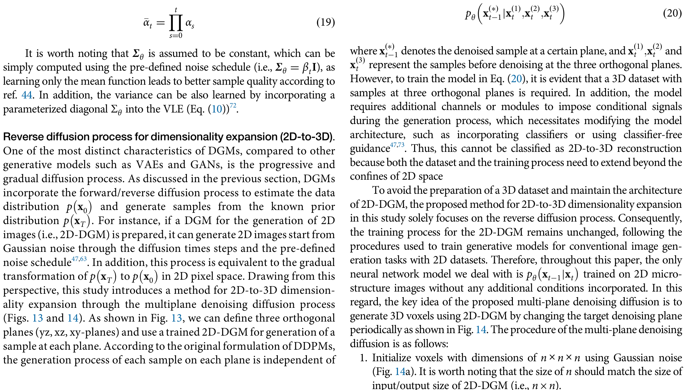
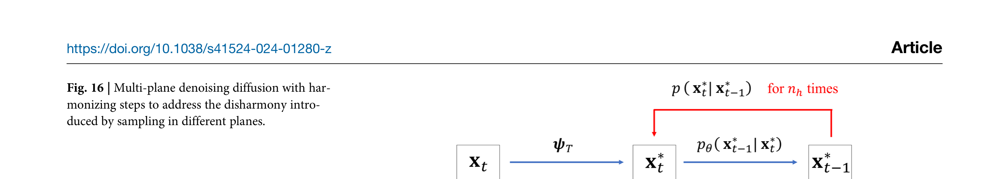
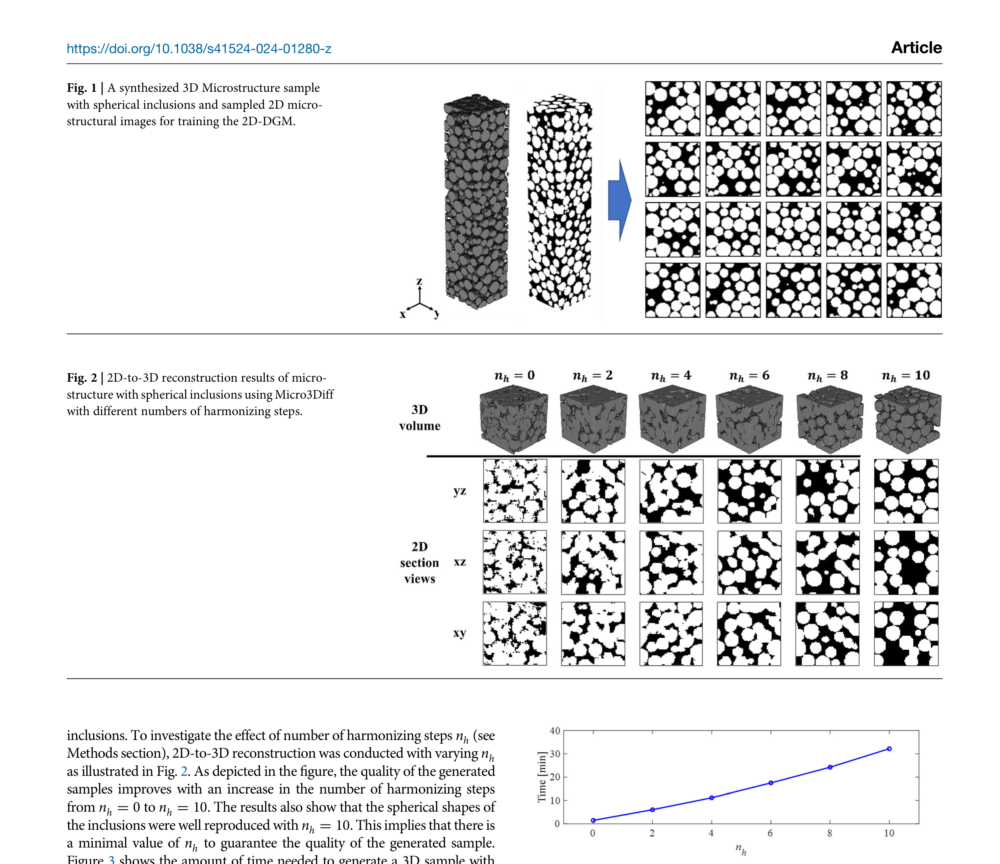

# Multi-plane denoising diffusion-based dimensionality expansion for 2D-to-3D reconstruction of microstructures with harmonized sampling

- **저자**: Kang-Hyun Lee, Gun Jin Yun
- **학회/날짜**: npj Computational Materials (2024)
- **URL**: [https://doi.org/10.1038/s41524-024-01280-z](https://doi.org/10.1038/s41524-024-01280-z)
- **GitHub**: Not specified in the paper.

---

### 1. 배경
3차원 미세구조를 특성화하는 것은 재료의 특성을 이해하는 데 필수적이지만, X-ray CT나 연속 절단법(serial sectioning) 등을 통해 3D 데이터셋을 획득하는 것은 비용과 시간이 매우 많이 듭니다. 반면, 2D 미세조직 사진(micrographs)은 풍부하고 획득하기 쉽습니다. 기존의 2D-to-3D 재구성 방법들은 방대한 3D 학습 데이터에 의존하거나, 3차원 공간에서의 공간적 연결성과 물리적 사실성을 유지하는 데 어려움이 있었습니다. 따라서 고가의 3D 데이터 없이도 2D 지식을 3D로 확장할 수 있는 새로운 프레임워크가 절실히 필요했습니다.

### 2. 직관
핵심 직관은 "유효한 3D 구조라면 어떤 직교 방향(XY, YZ, ZX 평면)에서 잘라도 사실적인 2D 이미지처럼 보여야 한다"는 것입니다. 조각가가 3D 작품을 만드는 과정을 상상해 보세요. 정면, 측면, 위에서 끊임없이 모양을 확인하고 다듬음으로써 전체적으로 일관된 형태를 완성합니다. Micro3Diff는 이 원리를 적용하여, 사전 학습된 2D 확산 모델(Diffusion Model)을 사용해 세 방향의 모든 단면을 동시에 "노이즈 제거(denoising)"하거나 "정제"함으로써, 이들이 하나의 연결된 3D 볼륨으로 조화롭게 합쳐지도록 강제합니다.

### 3. 돌파구
이 논문의 결정적인 통찰(Aha! insight)은 **차원 확장(dimensionality expansion)을 학습 단계가 아닌 추론(sampling) 단계에서 수행**한다는 것입니다. 이는 기존에 이미 구축된 고품질의 2D 확산 생성 모델(DGM)을 그대로 활용할 수 있음을 의미하며, 생성 과정에서만 3D 일관성을 부여하면 됩니다. 결과적으로 별도의 3D 학습 데이터가 전혀 필요하지 않아, 재료 과학자들이 매우 유연하고 효율적으로 이 프레임워크를 사용할 수 있게 되었습니다.

### 4. 기술적 메커니즘

#### 4.1 파이프라인

- (1) 이 도식은 노이즈가 섞인 3D 볼륨이 세 개의 직교 평면(YZ, XZ, XY)으로 어떻게 분해되는지 보여줍니다. (2) 이 슬라이스들은 사전 학습된 2D 확산 모델을 통해 반복적으로 노이즈가 제거되며, 접합부에서의 정보 중첩을 통해 3D 연결성이 암시적으로 강제됩니다.

#### 4.2 아키텍처 / 핵심 설계

- (1) 이 그림은 주기적으로 노이즈 제거 평면을 교체할 때 발생하는 "불협화음"을 해결하는 **조화로운 샘플링**(Harmonized Sampling) 루프를 묘사합니다. (2) 각 시간 단계는 노이즈 제거와 그 뒤의 "재노이즈화"(가우시안 노이즈를 다시 약간 추가) 과정을 반복하여, 3D 볼륨이 물리적으로 더 일관된 궤적에 안착하도록 유도합니다.

#### 4.3 핵심 공식
- **공식**:

$$ x_{t-1} = \mathcal{G}\left( \bigcup_{p \in \{XY, YZ, ZX\}} \epsilon_\theta(\text{Slice}_p(x_t), \sigma_t) \right) $$

- 핵심 로직은 다중 평면 노이즈 제거로, $t$ 단계의 3D 볼륨 $x$를 세 직교 방향의 슬라이스에 적용된 2D 노이즈 제거 네트워크 $\epsilon_\theta$ 의 정보를 통합(함수 $\mathcal{G}$)하여 업데이트합니다. 안정성을 보장하기 위해 역 확산 과정 중에 재노이즈화 단계 $p(x'_t | x_{t-1}) = \mathcal{N}(x'_t; \sqrt{1-\beta_t} x_{t-1}, \beta_t I)$ 가 여러 번($n_h$ 조화 단계) 적용됩니다.

- **변수**:
  - $x_t$: 확산 시간 단계 $t$에서의 3차원 미세구조 복셀 (섹션 4.1).
  - $\epsilon_\theta$: 모든 평면에서 공유되는 사전 학습된 2D 노이즈 제거 생성 모델(U-Net) (섹션 4.2).
  - $n_h$: 직교하는 노이즈 제거 평면 사이의 간극을 메우기 위해 사용되는 조화(재샘플링) 단계의 횟수 (그림 16).

#### 4.4 비교: 다른 기술 vs 이 논문
Micro3Diff는 일반적인 슬라이스별 생성 방식에 비해 우수한 3D 연결성과 형태학적 정확도를 보여줍니다. 기존 2D 방식들은 평면 외(out-of-plane) 일관성이 부족한 반면, Micro3Diff는 모든 방향에서 2점 상관 함수 ($S\_2$) 와 선형 경로 함수 ($L\_2$) 가 통계적으로 동일함을 입증했습니다 (섹션 3 / 그림 4). 조화로운 샘플링 과정은 단순한 다중 평면 접근법에 비해 다결정 입계와 같은 복잡한 특징을 포착하는 데 있어 오류율을 대폭 낮춥니다 (그림 5). 단, 세 평면에 대한 노이즈 제거 루프로 인해 3D 볼륨 생성당 계산 시간이 증가한다는 점이 트레이드오프(trade-off)로 언급됩니다 (섹션 3.1).

#### 4.5 정성적 결과

정성적 결과(그림 2)는 조화 단계의 횟수 ($n_h$) 가 재구성된 구형 개재물의 물리적 사실성에 어떻게 직접적인 영향을 미치는지 보여줍니다. $n_h=0$ 일 때는 구조에 상당한 아티팩트가 나타나고 슬라이스 간 연결성이 떨어지지만, $n_h=10$ 에서는 학습 데이터의 분포와 완벽하게 일치하는 매끄러운 구형 경계가 생성됩니다. 또한 이 프레임워크는 다결정 입자(그림 7)나 NMC 배터리 양극재(그림 9)와 같은 복잡한 다상 구조를 실제 3D 학습 샘플을 한 번도 보지 않고도 현실적인 3중점 기하 구조와 굴곡도를 유지하며 성공적으로 재구성합니다.

### 5. 영향
Micro3Diff는 재료 정보학(Materials Informatics) 분야에 강력한 도구를 제공하여, 연구자들이 손쉽게 구할 수 있는 2D 데이터로 고충실도 3D 미세구조를 생성할 수 있게 합니다. 이는 대규모 시뮬레이션 및 통합 계산 재료 공학(ICME)의 진입 장벽을 낮추며, 쉬운 2D 데이터 획득과 필수적인 3D 특성 분석 사이의 간극을 효과적으로 메워줍니다.

### 6. 후속 연구
[1] [MicroLad: 2D-to-3D Microstructure Reconstruction and Generation via Latent Diffusion and Score Distillation (2025)](https://arxiv.org/abs/2502.10052) 
3D 생성을 더 빠르고 제어 가능하게 하기 위해 프로세스를 잠재 공간(latent space)으로 옮긴 직접적인 후속 연구입니다.

[2] [Exascale granular microstructure reconstruction in 3D volumes of arbitrary geometries with generative learning](https://doi.org/10.1016/j.cma.2025.117764) 
이러한 생성 기법을 거대한 볼륨과 복잡한 경계 조건으로 확장하는 방안을 탐구합니다.

[3] [GrainPaint: A multi-scale diffusion-based generative model for microstructure reconstruction of large-scale objects](https://doi.org/10.1016/j.actamat.2025.120815) 
인페인팅 기반 확산을 활용해 대규모 다결정 재료를 재구성하는 데 집중합니다.
