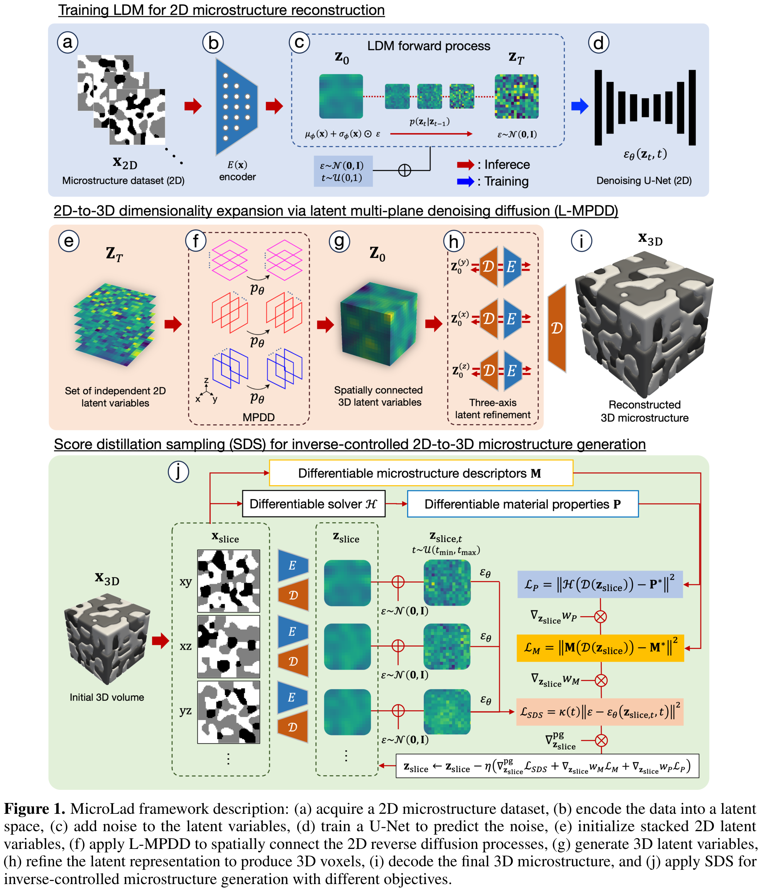
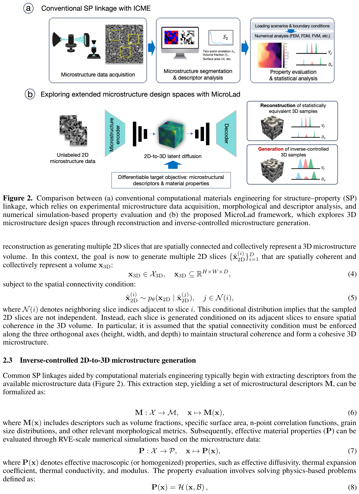
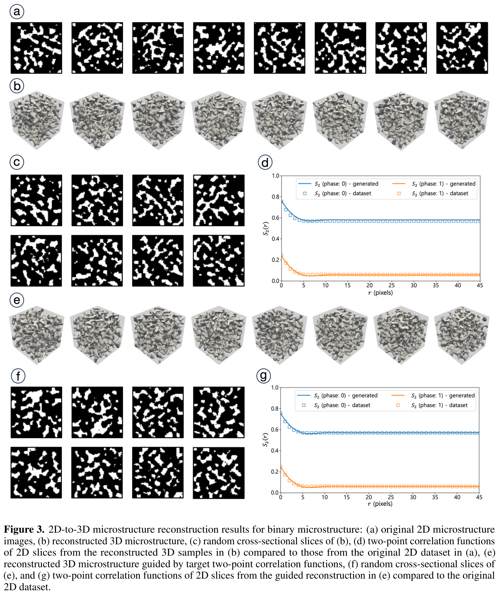
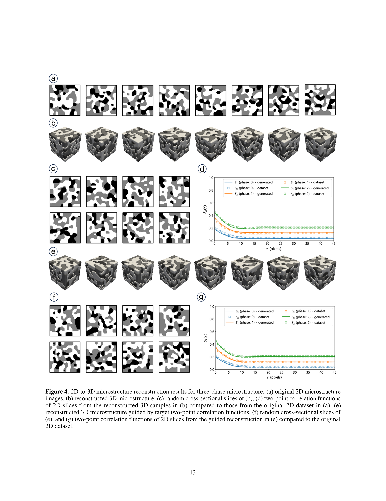

# MicroLad: 2D-to-3D Microstructure Reconstruction and Generation via Latent Diffusion and Score Distillation

- **저자**: Kang-Hyun Lee, Faez Ahmed
- **학회/날짜**: Computer Methods in Applied Mechanics and Engineering (2026)
- **URL**: [https://arxiv.org/abs/2508.20138](https://arxiv.org/abs/2508.20138)
- **GitHub**: [https://github.com/KangHyunL/microlad](https://github.com/KangHyunL/microlad)

---

### 1. 배경
대표적인 3D 미세구조 데이터셋을 확보하는 것은 통합 계산 재료 공학(ICME)에 핵심적이지만, X-ray CT나 연속 절단법 등의 높은 실험 비용으로 인해 여전히 매우 어렵습니다. 2D 미세조직 사진은 비교적 쉽게 얻을 수 있지만, 기존의 2D-to-3D 재구성 방법들은 근본적인 한계를 가지고 있습니다. 기술자(descriptor) 기반 방법은 선택된 기술자의 정보량에 의해 제한되며, 서로 다른 미세구조가 거의 동일한 통계치를 공유할 수 있습니다. SliceGAN이나 다중 평면 노이즈 제거 확산(MPDD) 같은 데이터 기반 방법은 통계적으로 동등한 3D 볼륨을 재구성할 수 있지만, 학습 분포를 *넘어서는* 미세구조를 생성할 수 없어 설계 공간 탐색이 제한됩니다. 충실한 재구성과 목표 물성을 향한 역설계(inverse design)를 동시에 수행할 수 있는 프레임워크가 필요했습니다.

### 2. 직관
재료의 2D 단면 사진 한 장만 가지고, 모든 각도에서 사실적으로 보일 뿐 아니라 특정 목표 물성(예: 최대 확산율)을 달성하는 완전한 3D 모델을 구축하고 싶다고 상상해 보세요. MicroLad는 먼저 어떤 방향에서든 사실적인 단면을 조각하는 법을 배운(사전 학습된 2D 잠재 확산 모델) 조각가처럼 작동합니다. 이 조각가는 세 직교 방향에서 일관성을 확인하며 3D 블록을 조립합니다. 핵심적인 차별점은 추가적인 "코칭 신호"(Score Distillation Sampling)로, 각 단면을 원하는 물리적 특성 방향으로 미세하게 조정합니다. 마치 코치가 화가에게 사실적인 질감을 그리는 것뿐 아니라, 최종 구조가 열을 최적으로 전도하도록 배치를 안내하는 것과 같습니다.

### 3. 돌파구
MicroLad의 결정적인 통찰은 **잠재 확산(Latent Diffusion) 기반 2D-to-3D 재구성**과 **Score Distillation Sampling(SDS)을 결합한 역설계**입니다. 이전의 확산 기반 방법들은 3D 미세구조를 재구성할 수 있었지만 학습 분포의 재현에 국한되었습니다. MicroLad는 사전 학습된 VAE를 통해 학습된 잠재 공간에서 작동하고, 다중 평면 확산으로 3D 정합성을 확보한 뒤, SDS를 적용하여 사용자가 지정한 목표—미세구조 기술자(체적 분율, 표면적) 또는 유효 물성(확산율)—방향으로 생성을 유도합니다. 이 모든 과정에서 확산 모델의 재학습이 필요하지 않습니다.

### 4. 기술적 메커니즘

#### 4.1 파이프라인

- (1) 이 그림은 MicroLad의 전체 파이프라인을 보여줍니다: (a) 2D 미세구조 데이터 획득, (b) VAE를 통한 잠재 공간 인코딩, (c) 잠재 확산 모델 학습, (d) 잠재 다중 평면 노이즈 제거 확산(L-MPDD)을 통한 2D-to-3D 재구성, (e) SDS 기반 역제어. (2) 핵심 설계 선택은 모든 확산 연산을 픽셀 공간이 아닌 압축된 잠재 공간(4×16×16)에서 수행하여 계산 비용을 대폭 줄인 것입니다.

#### 4.2 아키텍처 (Architecture)

- (1) 이 그림은 기존의 계산 재료 공학 워크플로(정방향 SP 연결만 가능)와 정방향·역방향 SP 연결을 모두 가능하게 하는 MicroLad 접근법을 대비합니다. (2) 핵심 혁신은 루프를 닫는 것입니다: 구조에서 물성만 예측하는 것이 아니라, 잠재 공간에서의 SDS 최적화를 통해 특정 물성을 목표로 하는 구조를 생성할 수 있습니다.

#### 4.3 핵심 공식

- **공식**:

$$ \mathcal{L}\_{\text{SDS}} = \kappa(t) \Vert \epsilon - \epsilon\_{\theta}(z\_{\text{slice},t}, t) \Vert^2, \text{ 단 } \kappa(t) = \frac{1 - \bar{\alpha}\_t}{\bar{\alpha}\_t} $$

- SDS 손실은 현재 잠재 단면이 동결된 확산 모델이 학습한 분포에 얼마나 잘 부합하는지를 측정합니다. 기술자 매칭 손실 ($\mathcal{L}\_{\text{M}} = \Vert M(\hat{x}\_{\text{slice}}) - M^{\ast} \Vert^2$)과 물성 손실 ($\mathcal{L}\_{\text{P}} = \Vert H(\hat{x}\_{\text{slice}}) - P^{\ast} \Vert^2$)와 결합되어, 전체 그래디언트가 잠재 표현을 사실적이면서도 원하는 목표 물성을 가진 미세구조 방향으로 유도합니다.

- **변수**:
  - $\epsilon\_{\theta}$: 확산 사전 정보를 제공하는 동결된 사전 학습 노이즈 제거 네트워크(U-Net) (섹션 3.4 / 식 39).
  - $z\_{\text{slice}}$: VAE 인코더 $E$에 의해 인코딩된 2D 단면의 잠재 표현 (섹션 3.4 / 식 37).
  - $M^{\ast}, P^{\ast}$: 사용자가 지정한 목표 미세구조 기술자 및 유효 물성 (섹션 3.4 / 식 42–43).
  - $H$: 유효 확산율 계산을 위한 미분 가능한 물리 솔버(FEM) (섹션 3.4 / 식 43).

#### 4.4 비교: 다른 기술 vs 이 논문
MicroLad는 기존 확산 기반 미세구조 재구성 방법의 역량을 크게 확장합니다. MPDD(Micro3Diff)가 2D 학습 데이터와 통계적으로 동등한 3D 볼륨을 재구성할 수는 있었지만, 제어된 목표 물성을 가진 미세구조를 생성할 수는 없었습니다. GAN 기반 접근법인 SliceGAN은 모드 붕괴(mode collapse) 문제가 있으며 물성 유도 생성이 불가능합니다. MicroLad는 잠재 공간(4×16×16 vs 전체 해상도)에서 작동하여 충실도를 유지하면서 계산 비용을 절감합니다. 재구성된 이진 및 삼상 미세구조의 2점 상관 함수 ($S_2$) 오류율은 일관되게 5% 미만입니다 (Section 4.1 / Fig 3–4). 결정적으로, MicroLad는 체적 분율, 표면적, 상대 확산율 목표에 대한 역제어 생성에 성공했습니다 (Section 4.2 / Fig 5–7). 단, 물성 유도 생성에는 미분 가능한 물리 솔버가 필요하여, 효율적으로 미분 가능한 물성에만 적용이 제한된다는 트레이드오프가 있습니다 (Section 3.4).

#### 4.5 정성적 결과

이진 탄산염 미세구조에 대한 정성적 결과는 MicroLad가 원래 2D 학습 이미지와 시각적으로 구분할 수 없는 단면을 가진 3D 볼륨을 충실하게 재구성함을 보여줍니다. 2점 상관 함수 ($S_2$) 와 선형 경로 함수 ($L_2$) 는 세 직교 방향 모두에서 생성 샘플과 원래 샘플 간에 우수한 일치를 나타냅니다 (Fig 3d). 재구성된 3D 볼륨은 실제 탄산염 미세구조의 특징인 현실적인 기공 연결성과 공간적 이질성을 보여줍니다.

삼상 SOFC(고체 산화물 연료전지) 미세구조의 경우, MicroLad는 기공상, 이온 전도상, 전자 전도상 각각의 고유한 형태를 성공적으로 포착하면서 이들의 공간적 상호 관계를 유지합니다. 세 상 모두의 $S_2$ 및 $L_2$ 함수가 원래 샘플과 밀접하게 일치하여 형태학적 충실도를 확인합니다 (Fig 4d). 이는 상간 경계가 물리적으로 일관되게 유지되어야 하는 다상 구조의 복잡성을 감안할 때 특히 주목할 만합니다.

### 5. 영향
MicroLad는 미세구조 특성 분석과 재료 설계 사이의 루프를 닫는 방향으로의 중요한 진전을 나타냅니다. 잠재 확산 모델을 Score Distillation Sampling 및 미분 가능한 물리 솔버와 결합함으로써, 연구자들이 2D 관찰로부터 사실적인 3D 미세구조를 재구성할 뿐 아니라 특정 재료 물성을 목표로 미세구조를 역설계할 수 있게 합니다. 이 역량은 에너지 재료(SOFC, 배터리), 구조 복합재 등 3D 미세구조가 성능을 좌우하는 시스템의 ICME 워크플로를 가속하는 데 직접적으로 활용될 수 있습니다.

### 6. 후속 연구
[1] [Multi-plane denoising diffusion-based dimensionality expansion (Micro3Diff) (2024)](https://doi.org/10.1038/s41524-024-01280-z) 
제1저자의 이전 프레임워크로, 2D-to-3D 재구성을 위한 다중 평면 확산의 기초를 확립. 
[2] [Score Distillation Sampling (DreamFusion) (2022)](https://arxiv.org/abs/2209.14988) 
2D 확산 모델의 지식을 3D 표현으로 증류하는 기초 기법. 
[3] [SliceGAN: GAN 기반 차원 확장을 통한 2D 슬라이스로부터의 3D 구조 생성 (2021)](https://arxiv.org/abs/2102.07708) 
2D-to-3D 미세구조 생성의 GAN 기반 베이스라인. 
[4] [Latent Diffusion Models (Stable Diffusion) (2021)](https://arxiv.org/abs/2112.10752) 
MicroLad가 기반한 핵심 잠재 확산 아키텍처. 
