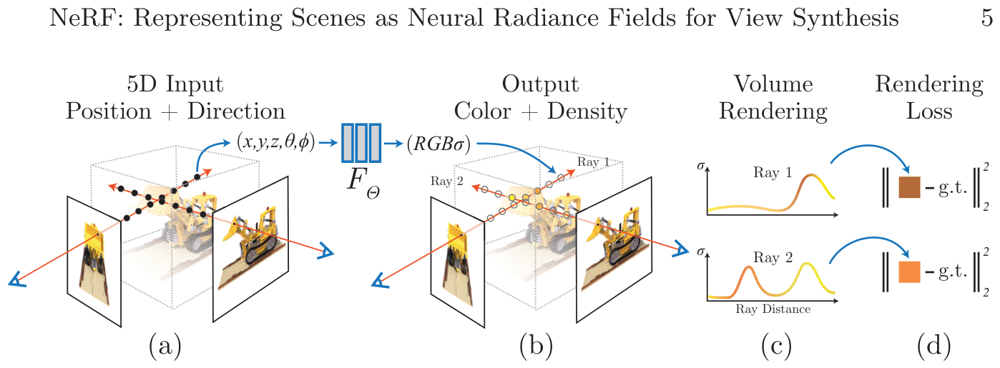
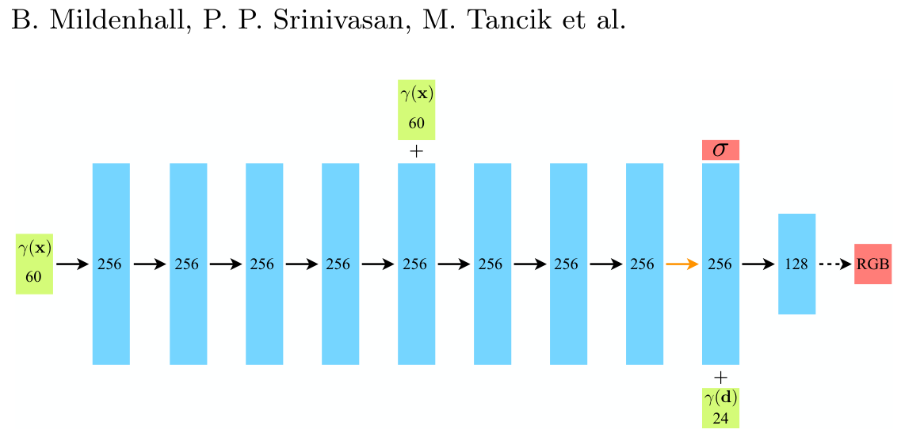
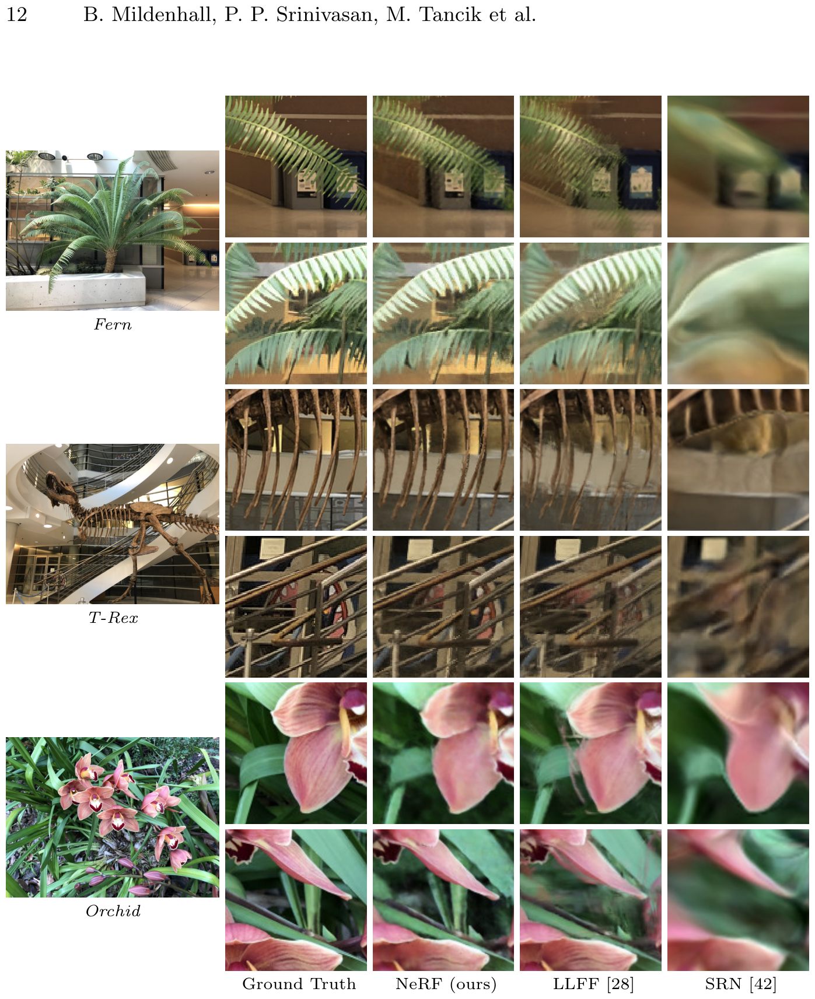

# NeRF: Representing Scenes as Neural Radiance Fields for View Synthesis

- **作者**: Ben Mildenhall, Pratul P. Srinivasan, Matthew Tancik, Jonathan T. Barron, Ravi Ramamoorthi, Ren Ng
- **会议/日期**: ECCV 2020
- **URL**: [https://arxiv.org/abs/2003.08934](https://arxiv.org/abs/2003.08934)
- **GitHub**: [https://github.com/bmild/nerf](https://github.com/bmild/nerf)

---

### 1. 背景
传统的视图合成方法大多依赖于离散的表示方式，如体素网格 (Voxel grids)、网格 (Meshes) 或多平面图像 (Multi-plane images)。这些方法的缺点是内存消耗巨大。例如，体素的内存使用量随分辨率呈立方级增长，这导致在表示复杂场景时结果变得模糊，或者场景的复杂度受到限制。网格在表示复杂的拓扑结构或透明度方面存在困难。因此，需要一种新的方法，能够在不产生固定内存开销的情况下连续表示场景，并能以高分辨率合成复杂的几何结构和外观。

### 2. 直觉
想象一下，三维空间充满了半透明的雾气，空间中的每个点都有特定的密度和随观察角度变化的颜色。这种“雾”不是固体物体，而是空间的连续属性。NeRF 的核心逻辑与此一致，它不将场景视为表面的集合，而是将其视为“辐射度 (Radiance)”和“不透明度 (Opacity)”的连续场 (Field)。当我们观察一个像素时，我们实际上是在向这层雾中照射手电筒（光线）并累积雾气反射的光线，这完美地模拟了光线的实际传播过程。

### 3. 突破
本文的决定性见解 (Aha! insight) 是使用由神经网络参数化的**连续函数**来代替体素等离散存储方式。我们不再是在表格中查找值，而是将三维坐标和二维观察方向作为输入，通过查询多层感知器 (MLP) 来获得该点的密度和颜色。由于这种“基于坐标 (Coordinate-based)”的表示方式，场景的分辨率仅受神经网络容量的限制，而不受物理网格大小的限制。

### 4. 技术机制

#### 4.1 流水线

- (1) 该图展示了从 2D 像素光线到 3D 采样和体绘制 (Volume Rendering) 的端到端过程。(2) 沿摄像机光线 (a) 进行点采样是在查询神经辐射场之前的第一个步骤。

#### 4.2 架构 (Architecture)

- (1) 该图描绘了 MLP 结构，其中三维位置和二维观察方向被分开处理。(2) 密度 $\sigma$ 仅使用位置信息进行预测，以确保在不同视角下的几何一致性，而颜色 $\mathbf{c}$ 则被设计为随视角变化。

#### 4.3 核心公式
- **公式**: $C(\mathbf{r}) = \int_{t\_n}^{t\_f} T(t) \sigma(\mathbf{r}(t)) \mathbf{c}(\mathbf{r}(t), \mathbf{d}) dt$, 其中 $T(t) = \exp\left(-\int_{t\_n}^t \sigma(\mathbf{r}(s)) ds\right)$
- 该公式通过对从近平面 (near plane) 到远平面 (far plane) 沿光线的所有点的密度和颜色进行积分，来计算摄像机光线的预期颜色。$T(t)$ 是“透射率 (Transmittance)”系数，表示光线在不碰到其他粒子的情况下到达该点的概率。
- **变量**:
  - $C(\mathbf{r})$: 对光线 $\mathbf{r}$ 预测的最终 RGB 颜色 (公式 2 / 第 4 节)。
  - $\sigma(\mathbf{x})$: 点 $\mathbf{x}$ 处的体密度，表示光线击中粒子的微分概率 (公式 1 / 第 3 节)。
  - $\mathbf{c}(\mathbf{x}, \mathbf{d})$: 从方向 $\mathbf{d}$ 观察点 $\mathbf{x}$ 时与视角相关的 RGB 颜色 (公式 1 / 第 3 节)。
  - $T(t)$: 从 $t\_n$ 到 $t$ 沿光线积累的透射率 (公式 3 / 第 4 节)。

#### 4.4 比较：其他技术 vs 本文
在捕获精细、高频纹理和复杂的镜面反射 (Specular reflection) 方面，NeRF 显著优于 SRN 或 NV 等先前的方法。SRN 无法保持清晰度，而 NV 受到体素分辨率的限制，相比之下，NeRF 利用位置编码 (Positional Encoding) 和层次化采样 (Hierarchical Sampling) 实现了最先进的性能 (第 6 节 / 表 1)。基于连续 MLP 的表示方法消除了多平面图像中常见的离散伪影。然而，NeRF 对于每个新场景都需要大量的优化时间，在单个 GPU 上通常需要 1-2 天 (第 6 节)。该方法的核心区别在于基于坐标的神经表示与经典体绘制的结合。

#### 4.5 定性结果

通过定性比较，我们可以看到 NeRF 如何重建 SRN、NV 和 LLFF 等基准模型容易忽略的复杂细节和逼真的非朗伯 (Non-Lambertian) 效应。对于“Realistic Synthetic 360°”数据集中的合成物体，与 SRN 或 LLFF 相比，NeRF 展示了更清晰的结果和更少的伪影。SRN 往往输出过于平滑或模糊的表面，而 NV 则会出现明显的体素化现象。LLFF 在复杂区域表现出重影 (Ghosting) 或缺乏多视图一致性。在许多情况下，NeRF 的结果在视觉上几乎无法与真实的地面真值 (Ground Truth) 图像区分开来 (图 6)。

### 5. 影响
NeRF 证明了可以使用作为连续函数的神经网络有效地存储和渲染复杂的 3D 场景，从而彻底改变了计算机视觉和图形学领域。这引发了关于神经辐射场 (Neural Radiance Fields) 的巨大研究浪潮，推动了 3D 重建、机器人和虚拟现实领域的发展。NeRF 的成功直接启发了后续研究，如高速变体 Instant-NGP 或大规模应用 Block-NeRF。

### 6. 后续研究
[1] [Mip-NeRF: A Multiscale Representation for Anti-Aliasing Neural Radiance Fields (2021)](https://arxiv.org/abs/2103.13415) 
解决了混叠问题并提高了多尺度下的渲染质量。

[2] [Instant Neural Graphics Primitives with a Multiresolution Hash Encoding](https://nvlabs.github.io/instant-ngp/) 
通过哈希编码将训练和渲染速度从几天缩短到几秒。

[3] [NeRF in the Wild: Neural Radiance Fields for Unconstrained Photo Collections](https://nerf-w.github.io/) 
改进了 NeRF，使其能够在光照不同且存在移动物体的环境（如互联网上的游客照片）中工作。

[4] [Block-NeRF: Scalable Neural Radiance Fields for Entire City Blocks](https://waymo.com/research/block-nerf/) 
扩展了 NeRF 以表示大规模环境，如整个城市街道。

[5] [RawNeRF: Preparing for Real HDR View Synthesis with Neural Radiance Fields](https://bmild.github.io/rawnerf/) 
直接学习摄像机的 RAW 数据，实现了高动态范围 (HDR) 视图合成和去噪。
