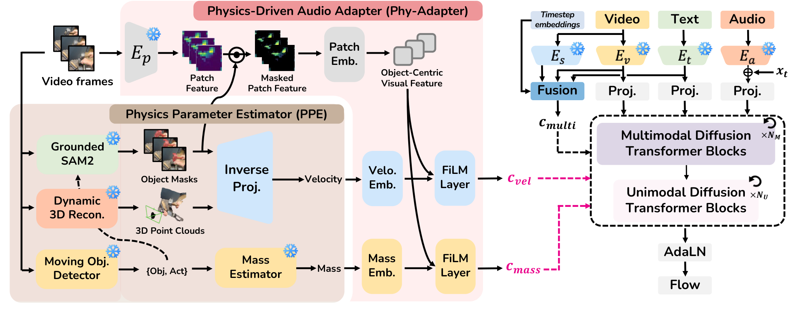
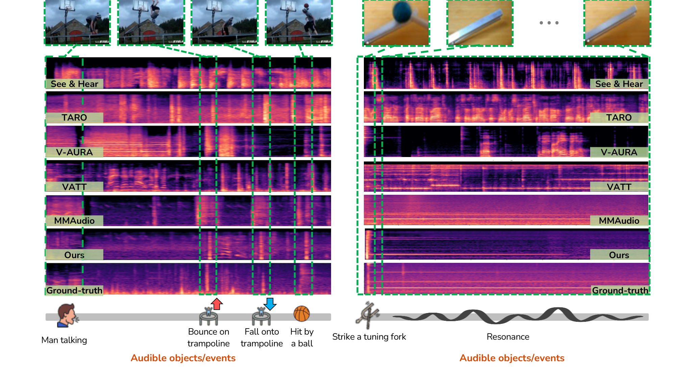

# PAVAS: Physics-Aware Video-to-Audio Synthesis

- **Authors**: Oh Hyun-Bin, Yuhta Takida, Toshimitsu Uesaka, Tae-Hyun Oh, Yuki Mitsufuji
- **Venue/Date**: CVPR 2026 (구두 발표) / arXiv 2026년 3월 30일 개정
- **URL**: [https://arxiv.org/abs/2512.08282](https://arxiv.org/abs/2512.08282)
- **GitHub**: 아직 공개되지 않았으며, 프로젝트 페이지에는 코드 공개 예정으로 표시되어 있습니다.

---

### 1. 배경

비디오에서 소리를 생성하는 모델은 이제 겉으로 드러나는 단서에는 꽤 강합니다. 영상에 개 짖는 장면, 북을 치는 장면, 망치질 장면이 보이면 대체로 알맞은 종류의 소리를 그럴듯한 시점에 만들 수 있습니다. 하지만 이런 모델은 대개 소리가 생기는 물리적 원인보다는 영상과 소리의 상관관계를 학습합니다. 망치와 가벼운 플라스틱 장난감은 모두 "무언가가 부딪히는 장면"으로 보일 수 있지만, 질량과 속도, 충돌 에너지가 다르면 소리의 크기, 감쇠, 스펙트럼의 날카로움도 달라져야 합니다. PAVAS가 필요한 이유는 여기에 있습니다. 소리는 장면의 이름만 맞추는 것이 아니라, 그 사건이 얼마나 강하게 일어났는지도 반영해야 합니다.

### 2. 직관

소리가 꺼진 영상을 보며 직접 효과음을 붙인다고 생각해 보십시오. 초보자는 장면을 "망치질"이라고 분류하고 일반적인 금속 충돌음을 붙일 수 있습니다. 숙련된 효과음 작업자는 망치가 얼마나 무거워 보이는지, 얼마나 빠르게 움직이는지, 충돌이 날카로운지 약한지, 물체가 어떻게 튀는지를 함께 봅니다. PAVAS는 비디오-오디오 모델에 두 번째 판단 방식을 넣으려 합니다. 단순히 "어떤 물체가 보이는가?"를 묻는 대신 "이 물체가 어떤 물리적 사건을 겪고 있는가?"를 묻고, 질량과 속도를 소리로 바뀔 에너지의 압축된 단서로 사용합니다.

### 3. 기술적 도약

핵심 통찰은 별도의 오디오-물리 정답 라벨 없이도 객체 단위의 물리량을 잠재 확산 기반 비디오-오디오 모델에 넣을 수 있다는 점입니다. PAVAS는 먼저 일반 단안 영상에서 물리 파라미터를 추정합니다. 비전-언어 모델은 움직이는 물체의 질량을 추정하고, 분할과 동적 3D 복원은 물체 궤적을 복원하여 속도를 계산합니다. 그런 다음 **물리 기반 오디오 어댑터**(Phy-Adapter)가 이 스칼라 물리 단서를 확산 트랜스포머의 조건 신호로 바꿉니다. 중요한 점은 물리 모듈이 별도의 시뮬레이터가 아니라는 것입니다. 물리는 생성 중인 오디오 잠재 경로를 잔차적으로 조절하여, 소리의 세기가 영상 속 물리적 동역학을 더 잘 따르도록 만드는 조건 신호가 됩니다.

### 4. 기술적 메커니즘

#### 4.1 파이프라인

- 이 그림은 무음 영상에서 생성 오디오까지의 PAVAS 흐름을 보여줍니다. PPE가 움직이는 물체의 질량과 속도를 추출하고, Phy-Adapter가 이 단서를 객체 중심 시각 특징과 결합한 뒤, 확산 트랜스포머가 영상, 텍스트, 오디오, 물리 조건을 함께 사용해 오디오 잠재 벡터를 생성합니다.
- 핵심 변수는 각 객체의 질량 $m\_i$와 프레임별 속도 $v\_i^\ell$입니다. 이 값들은 모델에 주입되는 물리 조건인 $c\_{\text{mass}}$와 $c\_{\text{vel}}$로 변환됩니다.

#### 4.2 아키텍처 / 핵심 설계

- 의사 그림 흐름: 비디오 프레임 -> 움직이는 객체 발견 -> 마스크와 3D 포인트 클라우드 -> 질량 및 속도 추정 -> 객체 중심 시각 특징 -> FiLM 조절 -> 확산 트랜스포머 블록 내부의 잔차 물리 조절.
- 핵심 설계 선택은 잔차 $\Delta$-조절입니다. 물리 단서는 0으로 초기화된 게이트 MLP를 통해 AdaLN 파라미터를 조정하므로, 사전 학습된 다중 모달 확산 경로를 원시 스칼라 입력으로 덮어쓰지 않고 물리 정보로 정교하게 보정합니다.

#### 4.3 핵심 공식

핵심 공식은 Phy-Adapter가 사용하는 $\Delta$-조절 규칙입니다. 기존 다중 모달 AdaLN 조절을 유지하면서, 질량과 속도 조건에서 온 학습 가능한 잔차 보정을 더합니다.

$$ \tilde{\omega} = \omega(\mathbf{c}\_{\text{multi}}) + \alpha\_m g\_m(\mathbf{c}\_{\text{mass}}) + \alpha\_v g\_v(\mathbf{c}\_{\text{vel}}) $$

- $\tilde{\omega}$: 각 확산 트랜스포머 블록 안에서 사용되는 물리 보강 AdaLN 조절 파라미터 (Eq 10).
- $\omega(\mathbf{c}\_{\text{multi}})$: 영상, 텍스트, 오디오, 시간 단계 조건에서 계산된 기존 AdaLN 스케일 및 시프트 파라미터 (Sec 3.4).
- $\mathbf{c}\_{\text{mass}}$: PPE의 질량 추정치와 객체 중심 시각 특징에서 만들어진 집계 질량 조건 (Sec 3.4).
- $\mathbf{c}\_{\text{vel}}$: PPE의 속도 시퀀스와 객체 중심 시각 특징에서 만들어진 집계 속도 조건 (Sec 3.4).
- $g\_m, g\_v$: 물리 조건을 잔차 조절항으로 변환하는 0 초기화 경량 MLP (Eq 10).
- $\alpha\_m, \alpha\_v$: 질량과 속도가 확산 블록에 얼마나 강하게 영향을 줄지 제어하는 학습 가능한 게이트 (Eq 10).

#### 4.4 비교: 기존 방식 vs 본 논문

See & Hear, V-AURA, VATT, TARO, FoleyCrafter, MMAudio 같은 기존 비디오-오디오 시스템은 의미적으로 관련 있고 시간적으로 동기화된 소리를 만들 수 있지만, PAVAS는 이들이 물리량과 음향 반응 사이의 결합을 충분히 포착하지 못한다고 지적합니다. 논문의 VGG-Impact 분석에서 많은 기준 모델의 APCC-∆ 값은 0.5를 넘는 반면, PAVAS-L은 0.378로 가장 낮은 APCC-∆를 기록하여 실제 소리의 물리-음향 관계에 더 가까웠습니다 (Table 1). 직접적인 기반 모델인 MMAudio-L과 비교하면, PAVAS-L은 $FD\_{\text{PaSST}}$를 60.60에서 47.38로 낮추고 IB-score를 33.22에서 35.41로 높였으며, DeSync는 거의 유지했습니다 (Table 1). 이 향상은 단순히 더 오래 학습해서 나온 것이 아닙니다. Table 3은 질량이나 속도를 각각 넣어도 도움이 되고, 둘을 함께 넣을 때 가장 좋으며, 잔차 $\Delta$-조절이 직접 합산보다 낫다는 점을 보여줍니다. 단점은 여러 사전 학습 비전 모듈에 의존하므로 엔지니어링 복잡도가 올라간다는 점이며, 현재는 명시적 재질 모델링 같은 더 풍부한 물리 요인보다는 질량과 속도에 초점을 둡니다 (Sec 5).

#### 4.5 질적 결과

그림 3은 여러 비디오-오디오 기준 모델, PAVAS, 실제 정답 소리의 스펙트로그램을 비교합니다. 트램펄린 예시에서 PAVAS 행은 표시된 시각 이벤트와 더 잘 맞는 선명한 스펙트럼 변화를 보이는 반면, 여러 기준 모델은 사건을 흐리게 만들거나 표시된 충돌 시점과 어긋난 강한 성분을 생성합니다. 소리굽쇠 예시에서도 몇몇 기준 모델은 넓고 불안정한 에너지 패턴을 만들지만, PAVAS는 정답 스펙트로그램에 보이는 지속적인 공명 구조를 더 잘 유지합니다. 이 그림만으로 완벽한 물리적 정확성을 증명할 수는 없지만, 명시적 물리 단서가 충돌과 공명 사건에 더 일관되게 반응하는 오디오를 만든다는 논문의 핵심 주장을 뒷받침합니다.

### 5. 임팩트

PAVAS는 비디오-오디오 합성을 "보이는 범주 맞추기"에서 "물리적 사건 맞추기"로 이동시킵니다. 이는 영화 효과음, 생성 영상 후반 작업, 로봇 시뮬레이션, 증강 현실처럼 소리가 물체 움직임에 반응해야 하는 응용에서 중요합니다. 벤치마크 기여도 큽니다. VGG-Impact와 APCC는 생성 소리가 고립적으로 그럴듯한지를 넘어서, 운동 에너지 변화에 맞춰 실제로 달라지는지를 평가하게 해 줍니다. 더 넓게 보면, 현실 동역학이 목표 신호를 지배하는 다중 모달 생성 문제에서는 압축된 물리 변수가 필요할 수 있다는 교훈을 줍니다.

### 6. 추가 읽을거리

[1] [MMAudio: Taming Multimodal Joint Training for High-Quality Video-to-Audio Synthesis (2025)](https://arxiv.org/abs/2412.15322) 
PAVAS의 직접적인 기반이 되는 강력한 참고 연구로, 다중 모달 공동 학습과 플로 매칭을 사용해 고품질 동기화 비디오-오디오 생성을 수행합니다. 
[2] [FoleyCrafter: Bring Silent Videos to Life with Lifelike and Synchronized Sounds (2024)](https://arxiv.org/abs/2407.01494) 
의미 정렬과 시간 제어를 어댑터 모듈로 분리한 텍스트 유도 비디오-오디오 생성 프레임워크입니다. 
[3] [Temporally Aligned Audio for Video with Autoregression (2025)](https://arxiv.org/abs/2409.13689) 
세밀한 시간 정렬과 영상-오디오 관련성에 초점을 둔 자기회귀 V2A 모델 V-AURA를 제안합니다. 
[4] [TARO: Timestep-Adaptive Representation Alignment with Onset-Aware Conditioning for Synchronized Video-to-Audio Synthesis (2025)](https://arxiv.org/abs/2504.05684) 
시각적으로 구동되는 소리 사건의 동기화를 개선하기 위해 시작점 인식 조건과 시간 단계 적응 정렬을 사용합니다. 
[5] [VAFlow: Video-to-Audio Generation with Cross-Modality Flow Matching (2025)](https://openaccess.thecvf.com/content/ICCV2025/html/Wang_VAFlow_Video-to-Audio_Generation_with_Cross-Modality_Flow_Matching_ICCV_2025_paper.html) 
일반적인 잡음-오디오 복원 경로 대신 비디오에서 오디오로 가는 변환 자체를 플로 매칭으로 직접 모델링합니다. 
[6] [StereoFoley: Object-Aware Stereo Audio Generation from Video (2025)](https://arxiv.org/abs/2509.18272) 
비디오-오디오 생성을 객체 인식 스테레오 소리로 확장하여, 공간적 객체-오디오 대응을 핵심 평가 대상으로 삼습니다. 
