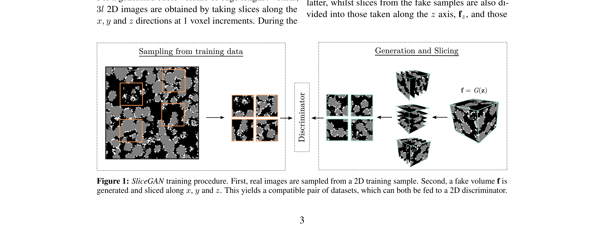
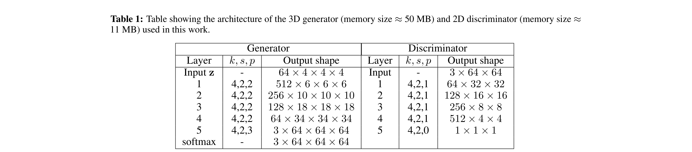
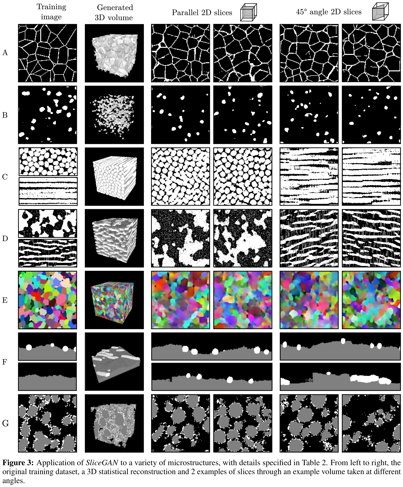

# Generating 3D Structures from a 2D Slice with GAN-Based Dimensionality Expansion

- **著者**: Steve Kench, Samuel J. Cooper
- **発表場所 / 日付**: Preprint - 2021年2月16日 (arXiv:2102.07708)
- **URL**: [https://arxiv.org/abs/2102.07708](https://arxiv.org/abs/2102.07708)
- **GitHub**: [https://github.com/stke9/SliceGAN](https://github.com/stke9/SliceGAN)

---

### 1. 背景
材料の物理的および化学的特性は、その3次元微細構造（マイクロストラクチャ）に大きく左右されます。しかし、高精度な3Dボリュームデータセットを（X線トモグラフィーなどで）取得することは、時間がかかりコストも高く、解像度にも限界があります。対照的に、SEM画像のような2D顕微鏡写真は、入手が容易で高解像度ですが、正確な物理シミュレーションに必要なボリュームの奥行き情報が欠けています。従来の統計的な再構成手法は、複雑で非ランダムなトポロジー的特徴を捉えることに限界があり、2Dから3Dへの「次元拡張」を実行できる生成的なアプローチが求められていました。

### 2. 直感
複雑な3Dの大理石模様のケーキ（マーブルケーキ）を再現しようとしていると想像してください。ケーキ全体の姿は見たことがなく、本物のケーキの薄いスライス写真しか持っていません。「SliceGAN」の直感は、もし生成した3Dケーキのどの断面（水平、垂直、奥行き方向）を切り取っても、持っている本物の2Dスライス写真と統計的に区別がつかないのであれば、その3Dケーキは統計的に実物の構造と一致しているはずだ、というものです。断面をマスターすることで、ボリューム全体を学習する仕組みです。

### 3. ブレイクスルー
SliceGANの核心的なブレイクスルーは、生成器（Generator）の次元と判別器（Discriminator）の次元を切り離したことにあります。生成器は3Dボリュームを生成しますが、判別器は2Dスライスのみを評価します。これにより、3Dの訓練データを使わず、広く普及している2D画像データのみを用いてモデルを訓練し、3Dボリュームを生成することが可能になりました。複数の平面において1Dから2Dへの統計的な一貫性を強制することで、モデルは材料の微細構造として物理的に妥当な方法で、第3の次元を効果的に「想像」します。

### 4. 技術的メカニズム

#### 4.1 パイプライン

- パイプラインは潜在ベクトル $z$ から始まり、3D生成器がこれをボリュームサンプル $f$ に変換します。このボリュームを $x, y, z$ 軸に沿ってスライスして2D画像を生成し、2D判別器がそれを実際の訓練用の顕微鏡像と比較してフィードバックを提供します。
- 主要モジュール: (1) ボリューム合成のための3D生成器 $G$、(2) 3Dと2Dのギャップを埋めるスライス操作。

#### 4.2 アーキテクチャ / コア設計

- このアーキテクチャでは、生成器に3D転置畳み込みを使用して1D潜在ベクトルを $64^3$ のボリュームに展開し、判別器にはスライスを評価するための標準的な2D畳み込みを使用します。
- 主要な設計上の選択: エッジのアーティファクトを回避し、生成されたボリューム全体で均一な情報密度を確保するため、空間的な入力 $z$ を $1 \times 1 \times 1$ ではなく $4 \times 4 \times 4$ に設定しました。

#### 4.3 コア方程式
- **選択基準**: 学習の安定性と高品質な合成を保証するために採用された、勾配ペナルティを含むWasserstein GAN損失関数（WGAN-GP）を選択しました。
- **方程式**:

$$L_D = \mathbb{E}[D(G(z)_s)] - \mathbb{E}[D(r)] + \lambda \mathbb{E}[(\|\nabla_{\hat{x}} D(\hat{x})\|_2 - 1)^2]$$

- この式は、偽のスライスの分布と本物の画像の分布の間の「距離」を測定します。
- **変数**: 
    - $G(z)_s$ = 生成された3Dボリュームの2Dスライス（3ページ）。
    - $r$ = 本物の2D訓練画像（3ページ）。
    - $\lambda$ = 学習安定化のための勾配ペナルティ係数。

#### 4.4 比較: 他の手法 vs 本論文
SliceGANは、長距離の連結性や複雑な相（フェーズ）を捉える能力において、従来の確率論的または相関ベースの再構成手法を大幅に凌駕します。ボリューム訓練データを必要とする標準的な3D GANとは異なり、このアプローチは広く利用可能な2D顕微鏡写真で動作します。論文では、一度訓練されれば、SliceGANは数秒で $10^8$ ボクセルのボリュームを生成できることを示しており、これは従来の物理シミュレーションと比較して $10^5$ 倍の加速を意味します。また、多結晶粒、セラミック繊維、バッテリー電極など、多様な材料に対して頑健であることが証明されています（セクション 5.2 / 図3）。

#### 4.5 定性的結果

定性的結果は、単純な粒子（行 A）から複雑な多相のバッテリーセパレータ材料（行 D）に至るまで、多様な微細構造の再構成に成功したことを示しています。左から右へ、元の2D訓練画像、生成された3Dボリューム、そして異なる角度で撮影されたスライスが並んでいます。特に、45度の角度のスライス（一番右の列）は、生成器が単に軸方向の向きを暗記したのではなく、一貫した3D表現を学習したことを証明しています。行 A の粒界にはオリジナルにはないわずかな曲率が見られますが、すべての材料タイプにおいて、全体的なトポロジーの連結性は非常にリアルに保たれています（図3）。

### 5. 影響
SliceGANは材料科学コミュニティに強力なツールを提供し、単純な2Dイメージングから、物理ベースのシミュレーション（応力解析や流体流動など）に必要な代表的な3Dボリュームの生成を可能にします。これは、高解像度の2Dデータと3Dボリューム分析の必要性との間のギャップを埋め、次世代のエネルギー材料や複合材料の発見と最適化を加速させる可能性を秘めています。

### 6. さらに読む
- [Super-resolution of multiphase materials by combining complementary 2D and 3D image data using generative adversarial networks (2021)](https://arxiv.org/abs/2110.11281) - 2Dと3D情報を組み合わせて微細構造を高解像度化する研究。
- [Micro3Diff: Multi-plane denoising diffusion-based dimensionality expansion (2023)](https://arxiv.org/abs/2308.14035) - 拡散モデル(Diffusion Model)を用いた最新の2D-to-3D再構成手法。
- [SliceGAN Github Issues/Discussions](https://github.com/stke9/SliceGAN) - 実装上のヒントやコミュニティによる後続研究。
