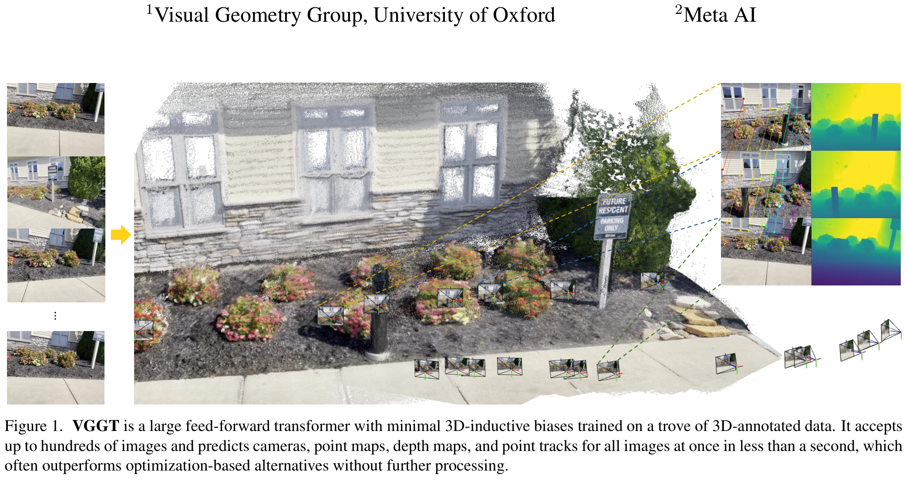
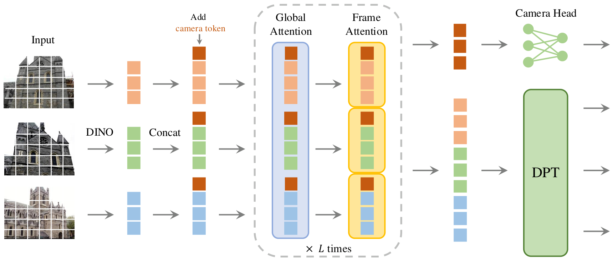
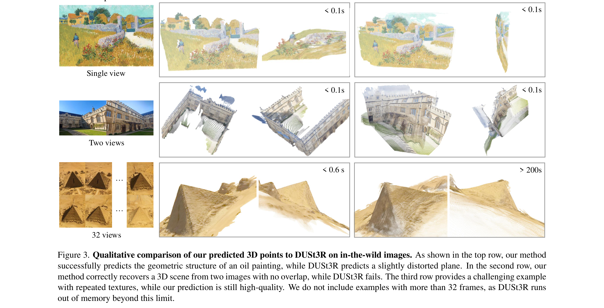

# VGGT: Visual Geometry Grounded Transformer

- **Authors**: Jianyuan Wang, Minghao Chen, Nikita Karaev, Andrea Vedaldi, Christian Rupprecht, David Novotny
- **Venue/Date**: CVPR 2025 (Best Paper Award) / arXiv 2025년 3월
- **URL**: [https://arxiv.org/abs/2503.11651](https://arxiv.org/abs/2503.11651)
- **GitHub**: [https://github.com/facebookresearch/vggt](https://github.com/facebookresearch/vggt)

---

### 1. 배경

전통적인 3차원 복원 작업은 **SfM**(Structure-from-Motion)이나 **번들 조정**(Bundle Adjustment)과 같은 시각 기하학적 방법에 의존해 왔으며, 이는 복잡한 반복 최적화 과정을 필요로 하여 처리 속도가 느리다는 단점이 있었습니다. 최근 DUSt3R와 MASt3R 같은 딥러닝 모델들이 기하학 중심의 설계를 선보였으나, 여전히 특정 작업(예: 두 이미지 매칭)에 국한되거나 전체 장면의 정렬을 위해 비용이 많이 드는 전역 최적화 단계를 거쳐야 했습니다. 단일 이미지부터 수백 장의 이미지까지 아우르는 통합적이고 빠른 "플러그 앤 플레이" 시스템의 필요성이 대두되었습니다.

### 2. 직관

흩어진 폴라로이드 사진 더미에서 원래의 건물 구조를 복원한다고 상상해 보십시오. 먼저 각 사진을 개별적으로 보며 사진 속 물체의 형태와 깊이를 파악해야 합니다 (**프레임별 어텐션**(Frame-wise Attention)). 그 다음, 사진들을 테이블 위에 늘어놓고 서로 겹치는 경계선을 맞추며 전체적인 3D 배치를 조율해야 합니다 (**글로벌 어텐션**(Global Attention)). VGGT는 바로 이 " juggling" 작업을 수행합니다. 즉, 각 사진 내부의 세밀한 3D 디테일을 완벽하게 다듬는 작업과 여러 시점 사이의 전역적 일관성을 유지하는 작업을 끊임없이 번갈아 수행하며 기하학적 구조를 완성합니다.

### 3. 핵심 기술

VGGT의 핵심적인 통찰은 바로 **교차 어텐션**(Alternating-Attention) 트랜스포머입니다. 이 모델은 하나의 거대한 어텐션 블록을 사용하는 대신, 개별 프레임 내부의 자기 어텐션과 모든 프레임 사이의 전역 어텐션을 의도적으로 번갈아 실행하도록 설계되었습니다. 이러한 단순하면서도 강력한 구조적 선택 덕분에, 기존에는 별도의 전문 모델이 필요했던 카메라 포즈 추정, 깊이 맵, 밀집 포인트 클라우드, 시계열 포인트 트래킹 등의 작업을 단 하나의 피드포워드 네트워크로 1초 이내에 모두 처리할 수 있게 되었습니다.

### 4. 기술적 메커니즘

#### 4.1 파이프라인

- 입력된 이미지들은 사전 학습된 DINO 백본을 통해 토큰으로 변환됩니다. 여기에 3D 상태를 나타내는 "카메라 토큰"이 추가되어, 교차 어텐션 층을 통과하며 3D 기하 구조를 해소합니다.
- (1) 모델은 카메라, 포인트 맵, 깊이 맵, 포인트 트랙을 동시에 예측합니다. (2) 단 한 번의 피드포워드 연산으로 수많은 이미지를 동시에 처리할 수 있는 효율성을 갖췄습니다.

#### 4.2 아키텍처 / 핵심 설계

- VGGT는 각 프레임마다 고유한 "카메라 토큰"을 부여하여 전역적인 3D 상태를 표상합니다. 트랜스포머의 최종 특징은 **DPT**(Dense Prediction Transformer) 헤드와 선형 헤드를 통해 각각 밀집 지도와 카메라 파라미터로 디코딩됩니다.
- (1) 24개 층의 교차 어텐션을 사용하여 지역적 세부 사항과 전역적 맥락 사이의 균형을 유지합니다. (2) 첫 번째 프레임을 고유한 학습 가능 토큰으로 설정하여 이를 세계 좌표계의 기준으로 삼습니다.

#### 4.3 핵심 공식

모델은 카메라, 깊이, 포인트 맵 감독과 함께 **에일리어토릭 불확실성**(aleatoric uncertainty) $\Sigma$를 결합한 다중 작업 손실 함수로 학습됩니다. 예를 들어, 깊이 손실 함수는 값의 차이뿐만 아니라 경계의 선명도를 위한 그래디언트 항을 포함합니다.

$$ \mathcal{L}\_{\text{depth}} = \sum_{i=1}^N \left( \Vert \Sigma\_i^D \odot (\hat{D}\_i - D\_i) \Vert + \Vert \Sigma\_i^D \odot (\nabla \hat{D}\_i - \nabla D\_i) \Vert - \alpha \log \Sigma\_i^D \right) $$

- $D\_i$: $i$ 번째 프레임의 정답 깊이 값 (Sec 3.4).
- $\hat{D}\_i$: DPT 헤드를 통해 예측된 깊이 맵 (Sec 3.3).
- $\Sigma\_i^D$: 예측된 불확실성 지도로, 모델의 확신도에 따라 손실의 가중치를 조절함 (Sec 3.4).
- $\nabla$: 그래디언트 연산자로, 예측된 깊이가 물체의 날카로운 경계선을 유지하도록 유도함 (Sec 3.4).

#### 4.4 비교: 기존 방식 vs 본 논문 (증거 기반)

VGGT는 피드포워드 방식 3D 복원의 효율성과 정확도에서 새로운 기준을 제시합니다. 기존의 대표적인 방법인 MASt3R가 전역 정렬 최적화를 위해 장면당 약 9~10초를 소요하는 반면, VGGT는 순수 피드포워드 모드에서 단 0.2초 만에 더 우수한 결과를 도출합니다 (Table 3). 가장 큰 차별점은 통합된 교차 어텐션 트랜스포머를 사용하여 별도의 전용 모델이나 삼각 측량 없이도 모든 결과를 얻는다는 것입니다. RealEstate10K 벤치마크에서는 학습되지 않은 데이터임에도 불구하고 기존 최강 모델들보다 AUC@30 지표에서 10% 이상 높은 성능을 보였습니다 (Table 1). 다만, 피드포워드 결과만으로도 최첨단 수준이지만, 약간의 지연 시간을 감수하고 번들 조정 (BA)을 추가하면 정확도를 더욱 높일 수 있다는 트레이드오프가 존재합니다 (Sec 4.1).

#### 4.5 질적 결과

VGGT는 최적화 기반인 DUSt3R에 비해 탁월한 견고함을 보여줍니다. 그림 3에 기초하여 설명하면: 첫 번째 행에서 유화 그림의 기하학적 구조를 정확히 복원하는 반면, DUSt3R는 왜곡된 평면을 생성합니다. 시야가 겹치지 않는 어려운 사례(두 번째 행)에서도 VGGT는 장면 구조를 여전히 복원해내지만 DUSt3R는 완전히 실패합니다. 또한 반복되는 텍스처(세 번째 행)가 있는 경우에도 고품질의 기하 구조를 유지합니다. 특히 32 프레임 이상에서 메모리 부족으로 멈추는 DUSt3R와 달리, VGGT는 효율적인 확장을 통해 훨씬 큰 규모의 장면도 안정적으로 처리할 수 있습니다.

### 5. 임팩트

VGGT는 정확한 3D 복원을 위해서는 반복적인 최적화가 필수적이라는 기존의 고정관념을 성공적으로 깨뜨렸습니다. 잘 설계된 트랜스포머가 한 번의 연산만으로도 다중 시점 기하 구조를 학습할 수 있음을 입증함으로써 포즈, 깊이, 포인트 클라우드, 트래킹 등 다양한 비전 작업을 하나의 확장 가능한 백본으로 통합했습니다. 이는 실시간 로봇 공학, AR/VR, 자율 주행 분야의 기술 파이프라인을 획기적으로 단순화할 잠재력을 가집니다.

### 6. 추가 읽을거리
[1] [VGGT-X: When VGGT Meets Dense Novel View Synthesis (2025)](https://arxiv.org/abs/2509.25191) 
VGGT를 1,000장 이상의 이미지로 확장하고 가우시안 스플래팅에 최적화한 후속 연구입니다. 
[2] [MASt3R-SLAM: Real-Time Dense SLAM with 3D Reconstruction Priors (2024)](https://arxiv.org/abs/2412.12392) 
3D 복원 프라이어를 활용하여 다양한 카메라 모델에서 실시간 밀집 SLAM을 구현한 연구입니다. 
[3] [Pow3R: Empowering Unconstrained 3D Reconstruction with Camera and Scene Priors (2025)](https://arxiv.org/abs/2503.17316) 
광범위한 회귀 작업을 위한 멀티모달 3D 파운데이션 모델입니다. 
[4] [GaussTR: Foundation Model-Aligned Gaussian Transformer for Self-Supervised 3D Spatial Understanding (2024)](https://arxiv.org/abs/2412.13193) 
3D 가우시안 표현을 트랜스포머 아키텍처에 직접 통합하여 입체적 이해를 도모한 프레임워크입니다. 
