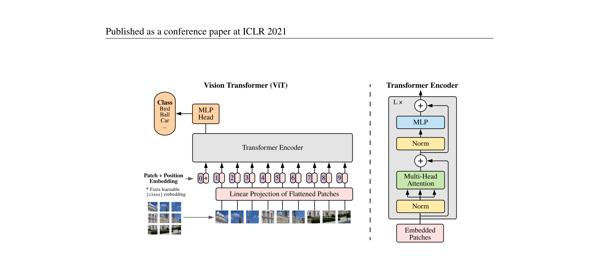
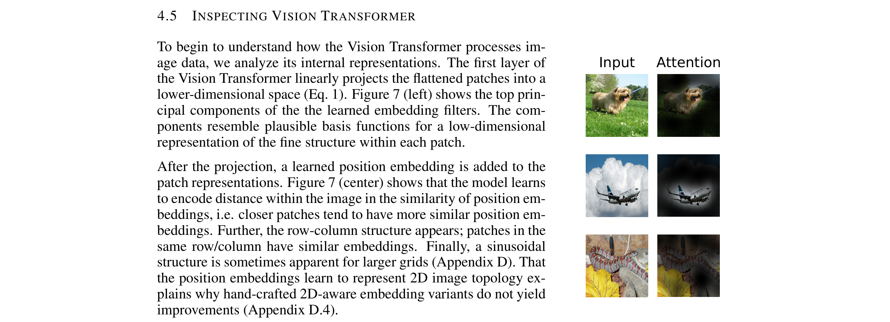

# An Image is Worth 16x16 Words: Transformers for Image Recognition at Scale
- **Authors**: Alexey Dosovitskiy, Lucas Beyer, Alexander Kolesnikov, Dirk Weissenborn, Xiaohua Zhai, Thomas Unterthiner, Mostafa Dehghani, Matthias Minderer, Georg Heigold, Sylvain Gelly, Jakob Uszkoreit, Neil Houlsby
- **Venue/Date**: ICLR 2021
- **URL**: https://arxiv.org/abs/2010.11929
- **GitHub**: https://github.com/google-research/vision_transformer

### 1. Background
- Previous approaches relied heavily on Convolutional Neural Networks (CNNs) for image feature extraction, often struggling to capture global relationships due to localized receptive fields.
- While Transformers completely changed Natural Language Processing, applying them directly to images pixel-by-pixel was computationally infeasible. This paper provides a necessary bridge by treating an image as a set of non-overlapping "patches", proving pure Transformers can match state-of-the-art CNNs.

### 2. Intuition
- Imagine reading a picture book. Instead of analyzing it dot by dot through a tiny magnifying glass (like a CNN), you cut the image into a grid of flashcards.
- The Vision Transformer (ViT) treats each 16x16 patch flashcard exactly like a word in a sentence, giving the model the capability to relate any detail across the entire image to any other detail instantly.

### 3. Breakthrough
- The "Aha!" insight is to completely discard convolutions. By flattening each non-overlapping visual patch into a linear vector and simply feeding them—along with their position tags—into a standard NLP Transformer, the model learns massive global relationships free of human-imposed visual biases.

### 4. Technical Mechanism

#### 4.1 Pipeline

- The raw image is split into fixed-size patches, which are linearly embedded with positional information and passed into a standard Transformer Encoder along with a dedicated classification token.
- What it shows: End-to-end processing of images via patch tokens.
- Key variable: The `[class]` token representation at the output layer entirely determines the final prediction.

#### 4.2 Architecture / Core Design

- The internal structure strictly adheres to the original NLP Transformer encoder structure, stacking alternating Multi-Head Self Attention and Multi-Layer Perceptron blocks.
- What it shows: Information flow and normalization at each transformer layer.
- Key design choice: ViT relies solely on self-attention and drops translation equivariance and locality biases, forcing it to learn spatial contexts strictly from large-scale data.

#### 4.3 Core Equation
- The Self-Attention mechanism discovers the relationship between all patches:

$$
\text{Attention}(Q, K, V) = \text{softmax}\left(\frac{QK^T}{\sqrt{d_k}}\right)V
$$

- $Q$: Query matrix representing patches searching for related context (Sec 3.1).
- $K$: Key matrix supplying the features that answer the queries.
- $V$: Value matrix providing the aggregated visual information.
- $d_k$: Dimensionality of the keys, used to scale the dot product and stabilize gradients.

#### 4.4 Comparison: Others vs This Paper
- The authors claim that when pre-trained on sufficiently massive datasets, a pure Transformer outperforms complex, heavily-engineered CNN architectures. Baseline CNNs like ResNet lack global receptive fields in early layers, keeping holistic understanding restricted. ViT differentiates itself by utilizing pure self-attention without any custom visual operators. This mechanism enables learning full long-range dependencies starting from the lowest layers (Sec 4.5 / Fig 11). As a trade-off, ViT requires tremendously large pre-training datasets (e.g., JFT-300M) because it lacks the helpful spatial inductive biases baked into standard convolutions.

#### 4.5 Qualitative Results

- The attention maps linking the output classification token back to the original image space reveal that ViT naturally discovers semantically meaningful regions within the object.
- The model robustly points its attention heads straight at the main subject in the image, efficiently suppressing background and clutter despite lacking explicit spatial architectural constraints.

### 5. Impact
- ViT fundamentally disrupted computer vision by demonstrating that convolutions are not strictly needed for top-tier image recognition. It ultimately unified the NLP and Vision domains, setting the immediate stage for modern multimodal and visual foundation models.

### 6. Further Reading
[1] [Attention Is All You Need (2017)](https://arxiv.org/abs/1706.03762) 
The foundational paper that introduced the original Transformer architecture. 
[2] [Training data-efficient image transformers & distillation through attention (2020)](https://arxiv.org/abs/2012.12877) 
Presents strategies to train ViT securely on smaller datasets without massive pre-training data. 
[3] [Swin Transformer: Hierarchical Vision Transformer using Shifted Windows (2021)](https://arxiv.org/abs/2103.14030) 
Extends ViT by computing self-attention within local shifted windows to provide hierarchical representations and high efficiency. 
