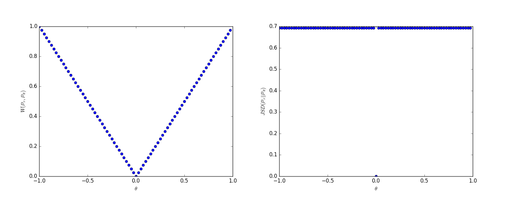
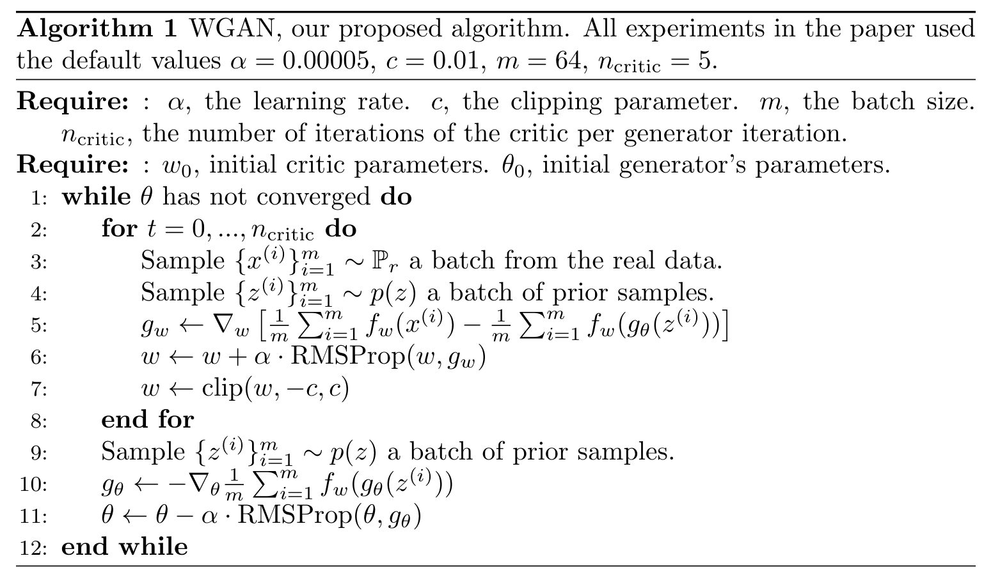
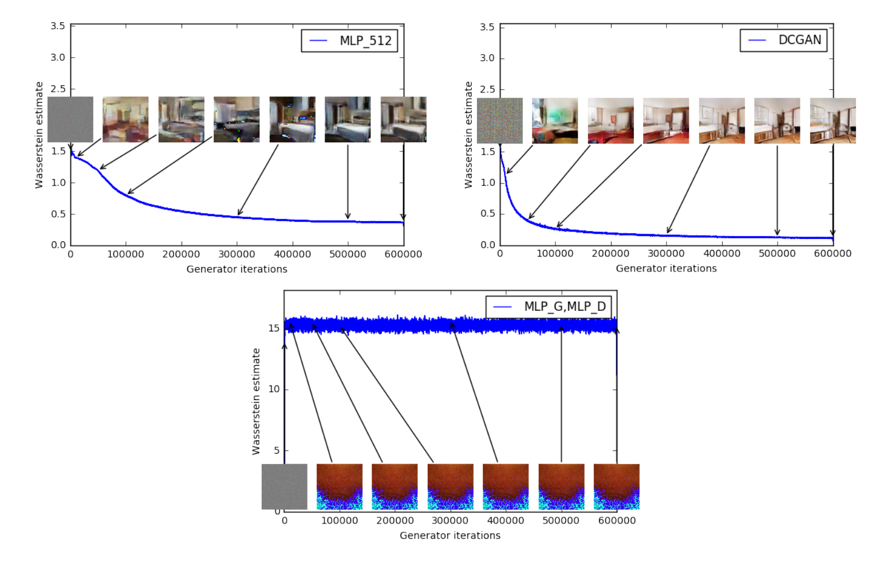

# Wasserstein GAN
- **저자**: Martin Arjovsky, Soumith Chintala, Léon Bottou
- **학회/일자**: ICML 2017 (arXiv:1701.07875)
- **URL**: https://arxiv.org/abs/1701.07875
- **GitHub**: https://github.com/martinarjovsky/WassersteinGAN

## 1. 배경
- 원조 GAN은 Jensen–Shannon (JS) 발산을 손실로 쓰는데, $p\_r$과 $p\_g$가 저차원 다양체(low-dimensional manifold) 위에 놓여 서포트가 겹치지 않는 — 이미지 데이터에서 사실상 항상 그러한 — 상황에서는 JS가 상수 $\log 2$로 포화되어 그래디언트가 0이 됩니다. 학습은 판별자 ($D$)를 "충분히 좋게, 하지만 너무 좋지는 않게" 유지하는 외줄타기로 변합니다.
- 커뮤니티의 임시방편이었던 픽셀 단위 가우시안 노이즈는 두 서포트를 강제로 겹치게 만들지만 표본을 흐리게 만들고 최대우도 추정을 편향시켰습니다. 서포트가 닿지 않을 때조차 매끄럽게 변하는 **새로운 분포 간 거리**(distance)가 필요했습니다.

## 2. 직관
- $p\_r$과 $p\_g$를 방 안의 두 모래 더미라고 상상해 봅시다. JS 발산은 "각 모래알이 정확히 같은 자리에 있는가?"라는 이진 질문을 던집니다. 한 알도 안 맞으면 답은 항상 "아니오"이며, 어느 방향으로 밀어야 할지 아무 정보도 주지 않습니다. Earth-Mover (Wasserstein) 거리는 대신 "한 더미를 다른 더미 모양으로 바꾸려면 모래를 최소 얼마만큼 옮겨야 하는가?"를 묻습니다.
- 이 운송비는 두 더미가 아무리 떨어져 있어도 의미가 살아 있고, 한 더미를 상대 쪽으로 밀수록 선형적으로 줄어듭니다. 그래서 이 거리에 기반한 손실은 두 분포가 겹치기도 전에 이미 **돌아갈 길**(point home)을 가리키는 그래디언트를 생성자에게 줍니다.

## 3. 돌파구
- EM 거리의 하한(infimum) 형태는 다루기 어렵지만, **Kantorovich–Rubinstein 쌍대성**(duality)이 이를 1-Lipschitz 함수에 대한 *상한*(supremum)으로 다시 씁니다: $W(p\_r, p\_g) = \sup\_{\Vert f \Vert\_L \le 1} \mathbb{E}\_{x \sim p\_r}[f(x)] - \mathbb{E}\_{x \sim p\_g}[f(x)]$. 이는 정확히 판별자 손실의 형태이며 — $\log$도 시그모이드도 없습니다 — 신경망으로 근사할 수 있습니다.
- Lipschitz 제약을 저렴하게 강제하기 위해 저자들은 매 갱신 후 **비평자**(critic)의 가중치를 작은 박스 $[-c, c]^l$로 잘라(clip) 버립니다. 거칠지만 효과적입니다. 파라미터 집합이 컴팩트해지면서 $f\_w$는 박스에만 의존하는 어떤 $K$에 대해 자동으로 $K$-Lipschitz가 되고, 네트워크는 포화 없이 **최적까지** 학습할 수 있게 됩니다.

## 4. 기술 메커니즘

### 4.1 파이프라인

- 두 패널을 나란히 보면 동기 전체가 드러납니다. 평행선(Example 1) 분포 $p\_0$, $p\_\theta$에 대해 왼쪽은 $W(p\_r, p\_\theta)$를 $\theta$의 함수로 그린 것 — 모든 곳에서 기울기가 $\pm 1$인 깔끔한 V자입니다 — 이고, 오른쪽은 $\mathrm{JSD}$로 $\theta = 0$ 한 점만 빼면 $\log 2$로 평평합니다.
- 핵심 변수: 그래디언트 $\partial \rho / \partial \theta$입니다. Wasserstein은 거의 모든 곳에서 그래디언트를 공급하지만 JS는 어디에서도 공급하지 않습니다 — ($D$)가 너무 좋아지면 GAN 학습이 멈추는 정확한 이유입니다.

### 4.2 아키텍처 / 핵심 설계

- "아키텍처"는 여기서도 학습 루프지만 원조 GAN과 세 가지 차이가 있습니다. ($D$)는 **비평자**(critic)로 이름이 바뀌고 시그모이드 없이 실수를 출력하며, 가중치 $w$는 매 갱신 후 $[-c, c]$로 잘리고 (line 7), 옵티마이저는 모멘텀 기반의 Adam이 아니라 **RMSProp**입니다 — 손실 표면이 비정상(non-stationary)이기 때문입니다.
- 핵심 설계 선택: 생성자 1회 갱신마다 비평자를 $n\_{\text{critic}} = 5$회 안쪽에서 갱신합니다. EM 손실은 절대 포화되지 않으므로 비평자를 *최적까지* 학습시킬수록 더 신뢰할 수 있는 그래디언트를 얻습니다 — "판별자를 너무 학습시키지 말라"는 GAN의 통념과 정반대 방향입니다.

### 4.3 핵심 수식
- 실제로 매 비평자 단계에서 최대화되는 WGAN의 실용 목적함수입니다.

$$
\max\_{w \in \mathcal{W}} \, \mathbb{E}\_{x \sim p\_r}[f\_w(x)] - \mathbb{E}\_{z \sim p(z)}[f\_w(g\_\theta(z))]
$$

- 변수:
  - $f\_w$: 가중치 $w$가 컴팩트 집합 $\mathcal{W} = [-c, c]^l$에 제약된 비평자 신경망 (Eq 3, Algo 1).
  - $g\_\theta$: 잠재 변수 $z$를 데이터 공간으로 보내는 생성자 (Sec 1).
  - $p\_r$: 실제 분포, $p\_g$: $g\_\theta(z)$가 만들어 내는 생성 분포 (Sec 2).
  - $c$: 가중치 클리핑 임계값, 기본값 $0.01$ (Algo 1).
  - $n\_{\text{critic}}$: 생성자 1회 갱신당 비평자 갱신 횟수, 기본값 $5$ (Algo 1).

### 4.4 비교: 기존 vs 본 논문
저자들은 WGAN이 GAN의 세 가지 악명 높은 병폐 — 그래디언트 소실, 모드 붕괴(mode collapse), 그리고 DCGAN만이 유일하게 안정적이었던 아키텍처 취약성 — 을 한 번에 치료한다고 주장합니다. 기존 모델의 한계는 구조적입니다. JS 발산은 분리된 다양체 위에서 *평평하기* 때문에 ($D$)는 포화되거나 ($G$)를 불안정하게 만듭니다. WGAN은 발산 자체를 교체해 Kantorovich–Rubinstein 쌍대성으로 EM의 하한을 최적화하고, 가중치 클리핑으로 Lipschitz 제약을 강제합니다. 메커니즘은 식 3의 비평자 손실이며, 증거는 두 갈래입니다. Figure 2는 비평자가 어디에서나 깔끔한 그래디언트를 갖는 *선형* 함수로 수렴하는 반면, GAN 판별자는 0/1로 포화되어 그래디언트를 전혀 주지 못함을 보여 줍니다. Figure 3은 Wasserstein 추정값이 단조 감소하면서 표본 품질을 추적함을 보여 주며 — 표준 GAN이 완전히 실패하는 아키텍처(MLP, batchnorm 없는 DCGAN)에서도 그렇습니다 (Sec 4.2, Figs 5–7). 트레이드오프도 동일하게 명시적입니다. 가중치 클리핑은 저자들 본인의 표현으로 "Lipschitz 제약을 강제하는 명백히 끔찍한 방법"이며 — $c$가 너무 작으면 깊은 망에서 그래디언트가 사라지고, 너무 크면 수렴이 느려집니다 — 모멘텀 계열 옵티마이저는 비평자를 불안정하게 만들 수 있어 RMSProp이 선호됩니다.

### 4.5 정성적 결과

- 각 서브플롯은 Wasserstein 추정값(비평자 손실, 파란 곡선)과 같은 반복 시점의 침실(bedroom) 표본을 함께 보여 줍니다. 위쪽 두 패널은 MLP 생성자와 DCGAN 생성자를 WGAN으로 학습한 것으로, 두 손실 곡선 모두 약 $6 \times 10^5$회 반복에 걸쳐 매끄럽게 하강하고 곡선과 발맞추어 인셋 표본도 선명해집니다.
- 가장 유익한 것은 아래쪽 패널(MLP 생성자 + MLP 비평자)입니다. 학습은 끝내 수렴하지 않고, 손실은 안정되지 않으며, 표본은 노이즈로 남습니다. 결정적으로 *곡선만 보고도* 이 사실을 읽을 수 있습니다. 동일 설정의 GAN은 그런 신호를 주지 않습니다 — 손실이 시종일관 무의미하기 때문에 — 그래서 실무자는 몇천 스텝마다 표본 그리드를 눈으로 확인해야 했습니다. WGAN은 손실 그 자체를 그동안 이 분야에 부재했던 디버깅 대시보드로 바꿔 놓습니다.

## 5. 영향
- WGAN은 적대적 학습을 **Lipschitz 제약 최적 수송**(optimal transport) 문제로 재정의했고, 손실 곡선이 처음으로 *의미를 갖게* 만들어 표본 그리드를 눈으로 보고 진척을 가늠하던 시대를 끝냈습니다. 그 원리는 WGAN-GP(그래디언트 패널티), 스펙트럼 정규화(spectral normalization), 그리고 Progressive Growing of GANs와 초기 StyleGAN 계열의 손실 함수로 직접 이어졌습니다.
- GAN을 넘어 이 논문은 적분 확률 메트릭(integral probability metric) 관점을 딥러닝에 정착시키는 데 기여했고, 이 관점은 평가 지표(FID의 기저 아이디어, sliced Wasserstein), 도메인 적응(domain adaptation)과 생성 모델링의 최적 수송 정규화, 심지어 확산 모델 학습 안정화에까지 등장합니다.

## 6. 더 읽을거리
[1] [Improved Training of Wasserstein GANs (2017)](https://arxiv.org/abs/1704.00028) 
WGAN-GP — 가중치 클리핑을 비평자 입력에 대한 그래디언트 패널티로 대체해 용량 손실을 해결하고 Adam을 다시 쓸 수 있게 만듭니다. 
[2] [Towards Principled Methods for Training Generative Adversarial Networks (2017)](https://arxiv.org/abs/1701.04862) 
JS 기반 GAN 학습이 저차원 다양체에서 그래디언트 소실을 겪는 이유를 형식적으로 진단한 자매 이론 논문. 
[3] [Spectral Normalization for Generative Adversarial Networks (2018)](https://arxiv.org/abs/1802.05957) 
레이어별 스펙트럼 노름 나눗셈으로 Lipschitz를 강제하는 드롭인 기법 — 훨씬 적은 연산으로 WGAN-GP에 필적합니다. 
[4] [f-GAN: Training Generative Neural Samplers using Variational Divergence Minimization (2016)](https://arxiv.org/abs/1606.00709) 
원조 GAN을 임의의 $f$-divergence로 일반화 — WGAN의 적분 확률 메트릭 관점에 대한 자연스러운 대비. 
[5] [Progressive Growing of GANs for Improved Quality, Stability, and Variation (2017)](https://arxiv.org/abs/1710.10196) 
WGAN-GP 손실 위에서 $1024^2$ 사실적 얼굴 합성까지 확장 — StyleGAN으로 직결되는 계보. 
[6] [Generative Adversarial Nets (2014)](https://arxiv.org/abs/1406.2661) 
WGAN이 명시적으로 진단하고 교체한 원조 미니맥스 + JS 목적함수. 
