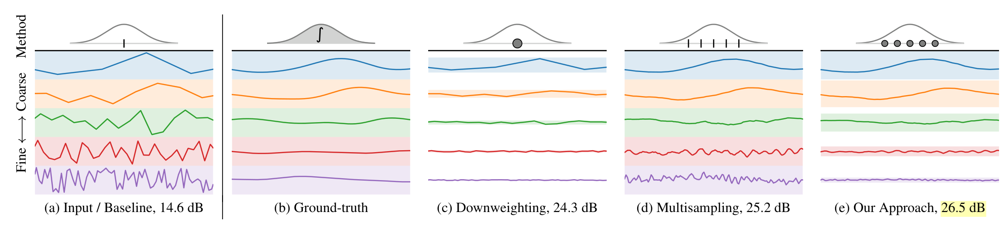
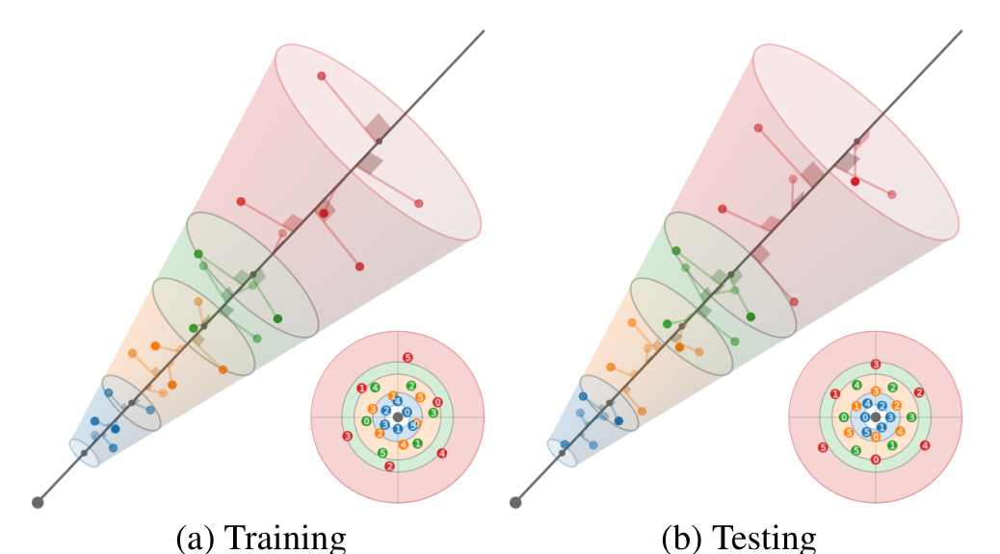
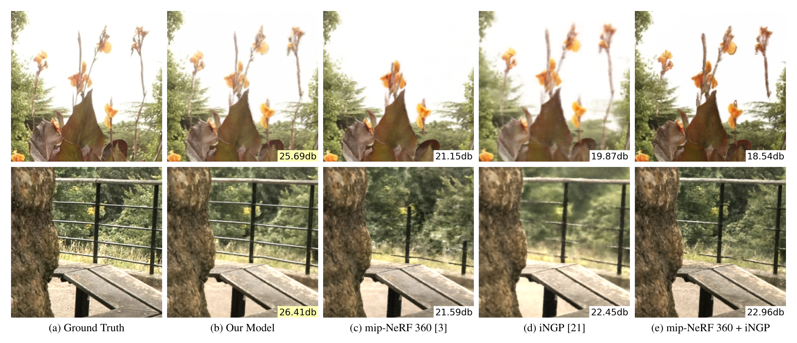

# Zip-NeRF: Anti-Aliased Grid-Based Neural Radiance Fields
- **Authors**: Jonathan T. Barron, Ben Mildenhall, Dor Verbin, Pratul P. Srinivasan, Peter Hedman
- **Venue/Date**: ICCV 2023
- **URL**: https://arxiv.org/abs/2304.06706
- **GitHub**: https://github.com/google-research/zip-nerf

### 1. 배경
기존의 신경 방사장(NeRF)은 느린 학습/렌더링 속도와 앨리어싱(계단 현상)이라는 두 가지 주요 문제에 직면해 왔습니다. Mip-NeRF는 원뿔 절두체(conical frustums)를 사용하여 앨리어싱을 해결했지만 속도가 느렸고, Instant NGP는 격자 기반 표현으로 속도를 높였지만 이산적인 점 샘플링으로 인해 앨리어싱 문제를 다시 야기했습니다. Zip-NeRF는 격자의 **속도**와 원뿔 절두체의 **항앨리어싱(anti-aliasing)** 성능을 결합하여 두 세계의 장점을 모두 취하고자 합니다.

### 2. 직관
그리드 위에 아주 얇은 붓으로 색칠한다고 상상해 보십시오(격자 기반 NeRF). 붓을 아주 조금만 움직여도 색이 급격하게 변할 수 있습니다(앨리어싱). Zip-NeRF는 각 픽셀에 대해 여러 개의 작은 붓을 동시에 사용하고, 그리드에 적용하기 전에 그 색상들을 평균 내는 것과 같습니다. 이렇게 하면 카메라를 어떻게 움직이더라도 부드러운 전환이 보장됩니다.

### 3. 핵심 돌파구
핵심 돌파구는 Instant NGP의 격자 피라미드를 mip-NeRF 360 프레임워크에 통합하는 **다중 샘플링(multisampling)** 전략입니다. 육각형 다중 샘플링 패턴과 사전 필터링된 손실(prefiltered loss)을 사용함으로써, 해시 기반 인코딩의 속도를 유지하면서도 격자 복셀의 스케일을 논리적으로 '이해'할 수 있게 되었습니다.

### 4. 기술적 메커니즘

#### 4.1 Pipeline

- 파이프라인은 다해상도 해시 그리드와 다중 샘플링 전략을 통합합니다. 단일 점 대신, 원뿔 절두체 볼륨을 표현하기 위해 육각형 패턴으로 간격당 6개의 점을 샘플링합니다.
- 핵심 모듈: 다해상도 해시 그리드와 절두체당 6점 육각형 다중 샘플링의 결합.

#### 4.2 Architecture / Core Design

- 아키텍처는 격자 특징이 샘플들에 대해 평균화되는 다중 샘플링 특징화(multisampled featurization)를 사용합니다. 이를 통해 MLP는 해당 깊이의 격자 해상도와 일치하는 '스케일 인식' 입력을 받게 됩니다.
- 설계 근거: 스케일 인식 입력 특징화가 고주파 노이즈가 MLP로 유입되는 것을 방지합니다 (Fig 3).

#### 4.3 Core Equation
- 스케일 인식 특징 $f$는 다중 샘플에 대해 삼선형 보간된 해시 그리드 특징을 평균하여 계산됩니다:
- $$f(\mathbf{x}, \sigma) = \frac{1}{J} \sum_{j=1}^{J} \text{tri}(\text{hash}(\mathbf{x}_j))$$
- Variables:
- $\mathbf{x}_j$: 원뿔 절두체 내의 $j$번째 다중 샘플 좌표 (Fig 3).
- $\sigma$: 샘플의 확산 정도를 결정하는 스케일 매개변수.
- $\text{tri}$: 해시 그리드 특징에 대한 삼선형 보간 (Eq 2).
- $J$: 샘플 수 (본 논문에서는 6으로 고정).

#### 4.4 Comparison: Others vs This Paper
Zip-NeRF는 mip-NeRF 360과 Instant NGP 모두를 압도하는 성능을 보여줍니다. mip-NeRF 360은 높은 수준의 항앨리어싱을 제공하지만 대규모 학습에는 너무 느립니다. 반면 Instant NGP는 빠르지만 줌 인/아웃 시 심각한 앨리어싱 아티팩트(계단 현상)를 생성합니다 (Sec 4.1). Zip-NeRF는 mip-NeRF 360보다 24배 빠르게 학습하면서도 오류율을 8%에서 77%까지 낮추었습니다 (Fig 1). 주요 트레이드오프는 다중 샘플링 특징으로 인한 약간 높은 메모리 사용량이지만, 속도와 품질 면에서의 이득이 이를 훨씬 상회합니다.

#### 4.5 Qualitative Results

- 정성적 결과는 Zip-NeRF가 기존 격자 기반 모델에서 소실되거나 깨졌던 나뭇잎이나 난간과 같은 가늘고 세밀한 구조를 복원하는 데 탁월함을 보여줍니다. 실측 자료(Ground Truth)와의 비교(Fig 1)를 통해 Zip-NeRF의 렌더링이 실제 이미지와 거의 구별할 수 없을 정도인 반면, 이전의 빠른 방법들은 눈에 띄는 깜빡임과 노이즈를 보여줌을 알 수 있습니다.

### 5. 영향력
Zip-NeRF는 효율적이고 고품질인 시점 합성의 새로운 기준을 제시합니다. 이는 '연구용' 품질과 '상용' 속도 사이의 간극을 메워, VR 및 고사양 디지털 트윈과 같은 실제 응용 분야에 방사장 기술을 더 실용적으로 적용할 수 있게 합니다.

### 6. 추가 읽을거리

[1] [Mip-NeRF 360: Unbounded Anti-Aliased Neural Radiance Fields (2021)](https://arxiv.org/abs/2111.12077) 
비선형 장면 수축과 항앨리어싱 원뿔 절두체를 도입하여 비경계 장면을 다룬 선행 연구. 
[2] [Instant Neural Graphics Primitives with a Multiresolution Hash Encoding (2022)](https://arxiv.org/abs/2201.05989) 
Zip-NeRF가 항앨리어싱을 위해 최적화하는 빠른 해시 그리드 기반 특징화를 도입한 연구. 
[3] [3D Gaussian Splatting for Real-Time Radiance Field Rendering (2023)](https://arxiv.org/abs/2308.04079) 
볼륨 기반 필드 대신 명시적 점 기반 프리미티브를 사용하는 경쟁 최신 기법. 
[4] [MERF: Memory-Efficient Radiance Fields for Real-Time View Synthesis (2023)](https://arxiv.org/abs/2302.12249) 
실시간 브라우저 기반 방사장 렌더링에 초점을 맞춘 하이브리드 표현 방식. 
[5] [NeRF: Representing Scenes as Neural Radiance Fields (2020)](https://arxiv.org/abs/2003.08934) 
신경 방사장 혁명을 시작한 기초 논문. 

